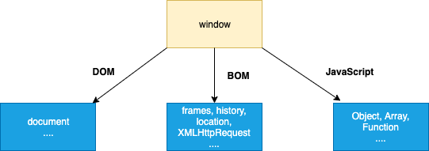
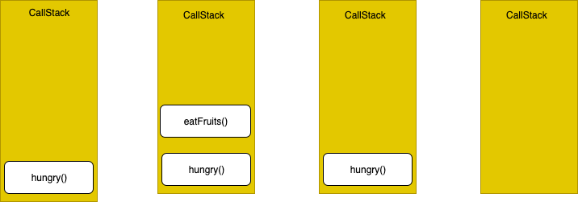

>* ## [JavaScript Interview Questions](README.md)

>* ##  [Reactjs Interview Questions](reactjs-interview-questions.md)

>*  ## [Nodejs Interview Questions](nodejs-interview-questions.md)

>* ##  [Html Interview Questions](html-interview-questions.md)

>* ##  [CSS Interview Questions](css-interview-questions.md)

>* ## [CSS Practice](css-practice.md)

----

# JavaScript Interview Questions & Answers

>

### Table of Contents

| No. | Questions                                                                                                                                                         |
| --- | ------------------------------- |
| 1   | [What are the possible ways to create objects in JavaScript](#what-are-the-possible-ways-to-create-objects-in-javascript)                                         |
| 2   | [What is prototype chain](#what-is-a-prototype-chain)                                                                                                             |
| 3   | [What is the difference between Call, Apply and Bind](#what-is-the-difference-between-call-apply-and-bind)                                                        |
| 4   | [What is JSON and its common operations](#what-is-json-and-its-common-operations)                                                                                 |
| 5   | [What is the purpose of the array slice method](#what-is-the-purpose-of-the-array-slice-method)                                                                   |
| 6   | [What is the purpose of the array splice method](#what-is-the-purpose-of-the-array-splice-method)                                                                 |
| 7   | [What is the difference between slice and splice](#what-is-the-difference-between-slice-and-splice)                                                               |
| 8   | [How do you compare Object and Map](#how-do-you-compare-object-and-map)                                                                                           |
| 9   | [What is the difference between == and === operators](#what-is-the-difference-between--and--operators)                                                            |
| 10  | [What are lambda or arrow functions](#what-are-lambda-or-arrow-functions)                                                                                         |
| 11  | [What is a first class function](#what-is-a-first-class-function)                                                                                                 |
| 12  | [What is a first order function](#what-is-a-first-order-function)                                                                                                 |
| 13  | [What is a higher order function](#what-is-a-higher-order-function)                                                                                               |
| 14  | [What is a unary function](#what-is-a-unary-function)                                                                                                             |
| 15  | [What is the currying function](#what-is-the-currying-function)                                                                                                   |
| 16  | [What is a pure function](#what-is-a-pure-function)                                                                                                               |
| 17  | [What is the purpose of the let keyword](#what-is-the-purpose-of-the-let-keyword)                                                                                 |
| 18  | [What is the difference between let and var](#what-is-the-difference-between-let-and-var)                                                                         |
| 19  | [What is the reason to choose the name let as a keyword](#what-is-the-reason-to-choose-the-name-let-as-a-keyword)                                                 |
| 20  | [How do you redeclare variables in switch block without an error](#how-do-you-redeclare-variables-in-switch-block-without-an-error)                               |
| 21  | [What is the Temporal Dead Zone](#what-is-the-temporal-dead-zone)                                                                                                 |
| 22  | [What is IIFE(Immediately Invoked Function Expression)](#what-is-iifeimmediately-invoked-function-expression)                                                     |
| 23  | [How do you decode or encode a URL in JavaScript?](#how-do-you-decode-or-encode-a-url-in-javascript)                                                              |
| 24  | [What is memoization](#what-is-memoization)                                                                                                                       |
| 25  | [What is Hoisting](#what-is-hoisting)                                                                                                                             |
| 26  | [What are classes in ES6](#what-are-classes-in-es6)                                                                                                               |
| 27  | [What are closures](#what-are-closures)                                                                                                                           |
| 28  | [What are modules](#what-are-modules)                                                                                                                             |
| 29  | [Why do you need modules](#why-do-you-need-modules)                                                                                                               |
| 30  | [What is scope in javascript](#what-is-scope-in-javascript)                                                                                                       |
| 31  | [What is a service worker](#what-is-a-service-worker)                                                                                                             |
| 32  | [How do you manipulate DOM using a service worker](#how-do-you-manipulate-dom-using-a-service-worker)                                                             |
| 33  | [How do you reuse information across service worker restarts](#how-do-you-reuse-information-across-service-worker-restarts)                                       |
| 34  | [What is IndexedDB](#what-is-indexeddb)                                                                                                                           |
| 35  | [What is web storage](#what-is-web-storage)                                                                                                                       |
| 36  | [What is a post message](#what-is-a-post-message)                                                                                                                 |
| 37  | [What is a cookie](#what-is-a-cookie)                                                                                                                             |
| 38  | [Why do you need a Cookie](#why-do-you-need-a-cookie)                                                                                                             |
| 39  | [What are the options in a cookie](#what-are-the-options-in-a-cookie)                                                                                             |
| 40  | [How do you delete a cookie](#how-do-you-delete-a-cookie)                                                                                                         |
| 41  | [What are the differences between cookie, local storage and session storage](#What-are-the-differences-between-cookie-local-storage-and-session-storage)          |
| 42  | [What is the main difference between localStorage and sessionStorage](#what-is-the-main-difference-between-localstorage-and-sessionstorage)                       |
| 43  | [How do you access web storage](#how-do-you-access-web-storage)                                                                                                   |
| 44  | [What are the methods available on session storage](#what-are-the-methods-available-on-session-storage)                                                           |
| 45  | [What is a storage event and its event handler](#what-is-a-storage-event-and-its-event-handler)                                                                   |
| 46  | [Why do you need web storage](#why-do-you-need-web-storage)                                                                                                       |
| 47  | [How do you check web storage browser support](#how-do-you-check-web-storage-browser-support)                                                                     |
| 48  | [How do you check web workers browser support](#how-do-you-check-web-workers-browser-support)                                                                     |
| 49  | [Give an example of a web worker](#give-an-example-of-a-web-worker)                                                                                                   |
| 50  | [What are the restrictions of web workers on DOM](#what-are-the-restrictions-of-web-workers-on-dom)                                                               |
| 51  | [What is a promise](#what-is-a-promise)                                                                                                                           |
| 52  | [Why do you need a promise](#why-do-you-need-a-promise)                                                                                                           |
| 53  | [What are the three states of promise](#what-are-the-three-states-of-promise)                                                                                     |
| 54  | [What is a callback function](#what-is-a-callback-function)                                                                                                       |
| 55  | [Why do we need callbacks](#why-do-we-need-callbacks)                                                                                                             |
| 56  | [What is a callback hell](#what-is-a-callback-hell)                                                                                                               |
| 57  | [What are server-sent events](#what-are-server-sent-events)                                                                                                         |
| 58  | [How do you receive server-sent event notifications](#how-do-you-receive-server-sent-event-notifications)                                                         |
| 59  | [How do you check browser support for server-sent events](#how-do-you-check-browser-support-for-server-sent-events)                                               |
| 60  | [What are the events available for server sent events](#what-are-the-events-available-for-server-sent-events)                                                     |
| 61  | [What are the main rules of promise](#what-are-the-main-rules-of-promise)                                                                                         |
| 62  | [What is callback in callback](#what-is-callback-in-callback)                                                                                                     |
| 63  | [What is promise chaining](#what-is-promise-chaining)                                                                                                             |
| 64  | [What is promise.all](#what-is-promiseall)                                                                                                                       |
| 65  | [What is the purpose of the race method in promise](#what-is-the-purpose-of-the-race-method-in-promise)                                                                   |
| 66  | [What is a strict mode in javascript](#what-is-a-strict-mode-in-javascript)                                                                                       |
| 67  | [Why do you need strict mode](#why-do-you-need-strict-mode)                                                                                                       |
| 68  | [How do you declare strict mode](#how-do-you-declare-strict-mode)                                                                                                 |
| 69  | [What is the purpose of double exclamation](#what-is-the-purpose-of-double-exclamation)                                                                           |
| 70  | [What is the purpose of the delete operator](#what-is-the-purpose-of-the-delete-operator)                                                                                 |
| 71  | [What is typeof operator](#what-is-typeof-operator)                                                                                                               |
| 72  | [What is undefined property](#what-is-undefined-property)                                                                                                         |
| 73  | [What is null value](#what-is-null-value)                                                                                                                         |
| 74  | [What is the difference between null and undefined](#what-is-the-difference-between-null-and-undefined)                                                           |
| 75  | [What is eval](#What-is-eval)                                                                                                                                     |
| 76  | [What is the difference between window and document](#what-is-the-difference-between-window-and-document)                                                         |
| 77  | [How do you access history in javascript](#how-do-you-access-history-in-javascript)                                                                               |
| 78  | [How do you detect caps lock key turned on or not](#how-do-you-detect-caps-lock-key-turned-on-or-not)                                                             |
| 79  | [What is isNaN](#what-is-isnan)                                                                                                                                   |
| 80  | [What are the differences between undeclared and undefined variables](#what-are-the-differences-between-undeclared-and-undefined-variables)                       |
| 81  | [What are global variables](#what-are-global-variables)                                                                                                           |
| 82  | [What are the problems with global variables](#what-are-the-problems-with-global-variables)                                                                       |
| 83  | [What is NaN property](#what-is-nan-property)                                                                                                                     |
| 84  | [What is the purpose of isFinite function](#what-is-the-purpose-of-isfinite-function)                                                                             |
| 85  | [What is an event flow](#what-is-an-event-flow)                                                                                                                   |
| 86  | [What is event bubbling](#what-is-event-bubbling)                                                                                                                 |
| 87  | [What is event capturing](#what-is-event-capturing)                                                                                                               |
| 88  | [How do you submit a form using JavaScript](#how-do-you-submit-a-form-using-javascript)                                                                           |
| 89  | [How do you find operating system details](#how-do-you-find-operating-system-details)                                                                             |
| 90  | [What is the difference between document load and DOMContentLoaded events](#what-is-the-difference-between-document-load-and-domcontentloaded-events)             |
| 91  | [What is the difference between native, host and user objects](#what-is-the-difference-between-native-host-and-user-objects)                                     |
| 92  | [What are the tools or techniques used for debugging JavaScript code](#what-are-the-tools-or-techniques-used-for-debugging-javascript-code)                       |
| 93  | [What are the pros and cons of promises over callbacks](#what-are-the-pros-and-cons-of-promises-over-callbacks)                                                   |
| 94  | [What is the difference between an attribute and a property](#what-is-the-difference-between-an-attribute-and-a-property)                                         |
| 95  | [What is same-origin policy](#what-is-same-origin-policy)                                                                                                         |
| 96  | [What is the purpose of void 0](#what-is-the-purpose-of-void-0)                                                                                                   |
| 97  | [Is JavaScript a compiled or interpreted language](#is-javascript-a-compiled-or-interpreted-language)                                                             |
| 98  | [Is JavaScript a case-sensitive language](#is-javascript-a-case-sensitive-language)                                                                               |
| 99  | [Is there any relation between Java and JavaScript](#is-there-any-relation-between-java-and-javascript)                                                           |
| 100 | [What are events](#what-are-events)                                                                                                                               |
| 101 | [Who created javascript](#who-created-javascript)                                                                                                                 |
| 102 | [What is the use of preventDefault method](#what-is-the-use-of-preventdefault-method)                                                                             |
| 103 | [What is the use of stopPropagation method](#what-is-the-use-of-stoppropagation-method)                                                                           |
| 104 | [What are the steps involved in return false usage](#what-are-the-steps-involved-in-return-false-usage)                                                                       |
| 105 | [What is BOM](#what-is-bom)                                                                                                                                       |
| 106 | [What is the use of setTimeout](#what-is-the-use-of-settimeout)                                                                                                   |
| 107 | [What is the use of setInterval](#what-is-the-use-of-setinterval)                                                                                                 |
| 108 | [Why is JavaScript treated as Single threaded](#why-is-javascript-treated-as-single-threaded)                                                                     |
| 109 | [What is an event delegation](#what-is-an-event-delegation)                                                                                                       |
| 110 | [What is ECMAScript](#what-is-ecmascript)                                                                                                                         |
| 111 | [What is JSON](#what-is-json)                                                                                                                                     |
| 112 | [What are the syntax rules of JSON](#what-are-the-syntax-rules-of-json)                                                                                           |
| 113 | [What is the purpose JSON stringify](#what-is-the-purpose-json-stringify)                                                                                         |
| 114 | [How do you parse JSON string](#how-do-you-parse-json-string)                                                                                                     |
| 115 | [Why do you need JSON](#why-do-you-need-json)                                                                                                                     |
| 116 | [What are PWAs](#what-are-pwas)                                                                                                                                  |
| 117 | [What is the purpose of clearTimeout method](#what-is-the-purpose-of-cleartimeout-method)                                                                         |
| 118 | [What is the purpose of clearInterval method](#what-is-the-purpose-of-clearinterval-method)                                                                       |
| 119 | [How do you redirect new page in javascript](#how-do-you-redirect-new-page-in-javascript)                                                                         |
| 120 | [How do you check whether a string contains a substring](#how-do-you-check-whether-a-string-contains-a-substring)                                                 |
| 121 | [How do you validate an email in javascript](#how-do-you-validate-an-email-in-javascript)                                                                         |
| 122 | [How do you get the current url with javascript](#how-do-you-get-the-current-url-with-javascript)                                                                 |
| 123 | [What are the various url properties of location object](#what-are-the-various-url-properties-of-location-object)                                                 |
| 124 | [How do get query string values in javascript](#how-do-get-query-string-values-in-javascript)                                                                     |
| 125 | [How do you check if a key exists in an object](#how-do-you-check-if-a-key-exists-in-an-object)                                                                   |
| 126 | [How do you loop through or enumerate javascript object](#how-do-you-loop-through-or-enumerate-javascript-object)                                                 |
| 127 | [How do you test for an empty object](#how-do-you-test-for-an-empty-object)                                                                                       |
| 128 | [What is an arguments object](#what-is-an-arguments-object)                                                                                                       |
| 129 | [How do you make first letter of the string in an uppercase](#how-do-you-make-first-letter-of-the-string-in-an-uppercase)                                         |
| 130 | [What are the pros and cons of for loop](#what-are-the-pros-and-cons-of-for-loop)                                                                                 |
| 131 | [How do you display the current date in javascript](#how-do-you-display-the-current-date-in-javascript)                                                           |
| 132 | [How do you compare two date objects](#how-do-you-compare-two-date-objects)                                                                                       |
| 133 | [How do you check if a string starts with another string](#how-do-you-check-if-a-string-starts-with-another-string)                                               |
| 134 | [How do you trim a string in javascript](#how-do-you-trim-a-string-in-javascript)                                                                                 |
| 135 | [How do you add a key value pair in javascript](#how-do-you-add-a-key-value-pair-in-javascript)                                                                   |
| 136 | [Is the '!--' notation represents a special operator](#is-the----notation-represents-a-special-operator)                                                           |
| 137 | [How do you assign default values to variables](#how-do-you-assign-default-values-to-variables)                                                                   |
| 138 | [How do you define multiline strings](#how-do-you-define-multiline-strings)                                                                                       |
| 139 | [What is an app shell model](#what-is-an-app-shell-model)                                                                                                         |
| 140 | [Can we define properties for functions](#can-we-define-properties-for-functions)                                                                                 |
| 141 | [What is the way to find the number of parameters expected by a function](#what-is-the-way-to-find-the-number-of-parameters-expected-by-a-function)               |
| 142 | [What is a polyfill](#what-is-a-polyfill)                                                                                                                         |
| 143 | [What are break and continue statements](#what-are-break-and-continue-statements)                                                                                 |
| 144 | [What are js labels](#what-are-js-labels)                                                                                                                         |
| 145 | [What are the benefits of keeping declarations at the top](#what-are-the-benefits-of-keeping-declarations-at-the-top)                                             |
| 146 | [What are the benefits of initializing variables](#what-are-the-benefits-of-initializing-variables)                                                               |
| 147 | [What are the recommendations to create new object](#what-are-the-recommendations-to-create-new-object)                                                           |
| 148 | [How do you define JSON arrays](#how-do-you-define-json-arrays)                                                                                                   |
| 149 | [How do you generate random integers](#how-do-you-generate-random-integers)                                                                                       |
| 150 | [Can you write a random integers function to print integers with in a range](#can-you-write-a-random-integers-function-to-print-integers-with-in-a-range)         |
| 151 | [What is tree shaking](#what-is-tree-shaking)                                                                                                                     |
| 152 | [What is the need of tree shaking](#what-is-the-need-of-tree-shaking)                                                                                             |
| 153 | [Is it recommended to use eval](#is-it-recommended-to-use-eval)                                                                                                   |
| 154 | [What is a Regular Expression](#what-is-a-regular-expression)                                                                                                     |
| 155 | [What are the string methods available in Regular expression](#what-are-the-string-methods-available-in-regular-expression)                                       |
| 156 | [What are modifiers in regular expression](#what-are-modifiers-in-regular-expression)                                                                             |
| 157 | [What are regular expression patterns](#what-are-regular-expression-patterns)                                                                                     |
| 158 | [What is a RegExp object](#what-is-a-regexp-object)                                                                                                               |
| 159 | [How do you search a string for a pattern](#how-do-you-search-a-string-for-a-pattern)                                                                             |
| 160 | [What is the purpose of exec method](#what-is-the-purpose-of-exec-method)                                                                                         |
| 161 | [How do you change the style of a HTML element](#how-do-you-change-the-style-of-a-html-element)                                                                           |
| 162 | [What would be the result of 1+2+'3'](#what-would-be-the-result-of-123)                                                                                       |
| 163 | [What is a debugger statement](#what-is-a-debugger-statement)                                                                                                     |
| 164 | [What is the purpose of breakpoints in debugging](#what-is-the-purpose-of-breakpoints-in-debugging)                                                                |
| 165 | [Can I use reserved words as identifiers](#can-i-use-reserved-words-as-identifiers)                                                                               |
| 166 | [How do you detect a mobile browser](#how-do-you-detect-a-mobile-browser)                                                                                         |
| 167 | [How do you detect a mobile browser without regexp](#how-do-you-detect-a-mobile-browser-without-regexp)                                                           |
| 168 | [How do you get the image width and height using JS](#how-do-you-get-the-image-width-and-height-using-js)                                                         |
| 169 | [How do you make synchronous HTTP request](#how-do-you-make-synchronous-http-request)                                                                             |
| 170 | [How do you make asynchronous HTTP request](#how-do-you-make-asynchronous-http-request)                                                                           |
| 171 | [How do you convert date to another timezone in javascript](#how-do-you-convert-date-to-another-timezone-in-javascript)                                           |
| 172 | [What are the properties used to get size of window](#what-are-the-properties-used-to-get-size-of-window)                                                         |
| 173 | [What is a conditional operator in javascript](#what-is-a-conditional-operator-in-javascript)                                                                     |
| 174 | [Can you apply chaining on conditional operator](#Can-you-apply-chaining-on-conditional-operator)                                                                 |
| 175 | [What are the ways to execute javascript after page load](#what-are-the-ways-to-execute-javascript-after-page-load)                                               |
| 176 | [What is the difference between proto and prototype](#what-is-the-difference-between-proto-and-prototype)                                                         |
| 177 | [Give an example where do you really need semicolon](#give-an-example-where-do-you-really-need-semicolon)                                                         |
| 178 | [What is a freeze method](#what-is-a-freeze-method)                                                                                                               |
| 179 | [What is the purpose of freeze method](#what-is-the-purpose-of-freeze-method)                                                                                     |
| 180 | [Why do I need to use freeze method](#why-do-i-need-to-use-freeze-method)                                                                                         |
| 181 | [How do you detect a browser language preference](#how-do-you-detect-a-browser-language-preference)                                                               |
| 182 | [How to convert string to title case with javascript](#how-to-convert-string-to-title-case-with-javascript)                                                       |
| 183 | [How do you detect javascript disabled in the page](#how-do-you-detect-javascript-disabled-in-the-page)                                                           |
| 184 | [What are various operators supported by javascript](#what-are-various-operators-supported-by-javascript)                                                         |
| 185 | [What is a rest parameter](#what-is-a-rest-parameter)                                                                                                             |
| 186 | [What happens if you do not use rest parameter as a last argument](#what-happens-if-you-do-not-use-rest-parameter-as-a-last-argument)                             |
| 187 | [What are the bitwise operators available in javascript](#what-are-the-bitwise-operators-available-in-javascript)                                                 |
| 188 | [What is a spread operator](#what-is-a-spread-operator)                                                                                                           |
| 189 | [How do you determine whether object is frozen or not](#how-do-you-determine-whether-object-is-frozen-or-not)                                                     |
| 190 | [How do you determine two values same or not using object](#how-do-you-determine-two-values-same-or-not-using-object)                                             |
| 191 | [What is the purpose of using object is method](#what-is-the-purpose-of-using-object-is-method)                                                                   |
| 192 | [How do you copy properties from one object to other](#how-do-you-copy-properties-from-one-object-to-other)                                                       |
| 193 | [What are the applications of assign method](#what-are-the-applications-of-assign-method)                                                                         |
| 194 | [What is a proxy object](#what-is-a-proxy-object)                                                                                                                 |
| 195 | [What is the purpose of seal method](#what-is-the-purpose-of-seal-method)                                                                                         |
| 196 | [What are the applications of seal method](#what-are-the-applications-of-seal-method)                                                                             |
| 197 | [What are the differences between freeze and seal methods](#what-are-the-differences-between-freeze-and-seal-methods)                                             |
| 198 | [How do you determine if an object is sealed or not](#how-do-you-determine-if-an-object-is-sealed-or-not)                                                         |
| 199 | [How do you get enumerable key and value pairs](#how-do-you-get-enumerable-key-and-value-pairs)                                                                   |
| 200 | [What is the main difference between Object.values and Object.entries method](#what-is-the-main-difference-between-objectvalues-and-objectentries-method)       |
| 201 | [How can you get the list of keys of any object](#how-can-you-get-the-list-of-keys-of-any-object)                                                                 |
| 202 | [How do you create an object with prototype](#how-do-you-create-an-object-with-prototype)                                                                         |
| 203 | [What is a WeakSet](#what-is-a-weakset)                                                                                                                           |
| 204 | [What are the differences between WeakSet and Set](#what-are-the-differences-between-weakset-and-set)                                                             |
| 205 | [List down the collection of methods available on WeakSet](#list-down-the-collection-of-methods-available-on-weakset)                                             |
| 206 | [What is a WeakMap](#what-is-a-weakmap)                                                                                                                           |
| 207 | [What are the differences between WeakMap and Map](#what-are-the-differences-between-weakmap-and-map)                                                             |
| 208 | [List down the collection of methods available on WeakMap](#list-down-the-collection-of-methods-available-on-weakmap)                                             |
| 209 | [What is the purpose of uneval](#what-is-the-purpose-of-uneval)                                                                                                   |
| 210 | [How do you encode an URL](#how-do-you-encode-an-url)                                                                                                             |
| 211 | [How do you decode an URL](#how-do-you-decode-an-url)                                                                                                             |
| 212 | [How do you print the contents of web page](#how-do-you-print-the-contents-of-web-page)                                                                           |
| 213 | [What is the difference between uneval and eval](#what-is-the-difference-between-uneval-and-eval)                                                                 |
| 214 | [What is an anonymous function](#what-is-an-anonymous-function)                                                                                                   |
| 215 | [What is the precedence order between local and global variables](#what-is-the-precedence-order-between-local-and-global-variables)                               |
| 216 | [What are javascript accessors](#what-are-javascript-accessors)                                                                                                   |
| 217 | [How do you define property on Object constructor](#how-do-you-define-property-on-object-constructor)                                                             |
| 218 | [What is the difference between get and defineProperty](#what-is-the-difference-between-get-and-defineproperty)                                                   |
| 219 | [What are the advantages of Getters and Setters](#what-are-the-advantages-of-getters-and-setters)                                                                 |
| 220 | [Can I add getters and setters using defineProperty method](#can-i-add-getters-and-setters-using-defineproperty-method)                                           |
| 221 | [What is the purpose of switch-case](#what-is-the-purpose-of-switch-case)                                                                                         |
| 222 | [What are the conventions to be followed for the usage of switch case](#what-are-the-conventions-to-be-followed-for-the-usage-of-switch-case)                     |
| 223 | [What are primitive data types](#what-are-primitive-data-types)                                                                                                   |
| 224 | [What are the different ways to access object properties](#what-are-the-different-ways-to-access-object-properties)                                               |
| 225 | [What are the function parameter rules](#what-are-the-function-parameter-rules)                                                                                   |
| 226 | [What is an error object](#what-is-an-error-object)                                                                                                               |
| 227 | [When you get a syntax error](#when-you-get-a-syntax-error)                                                                                                       |
| 228 | [What are the different error names from error object](#what-are-the-different-error-names-from-error-object)                                                     |
| 229 | [What are the various statements in error handling](#what-are-the-various-statements-in-error-handling)                                                           |
| 230 | [What are the two types of loops in javascript](#what-are-the-two-types-of-loops-in-javascript)                                                                   |
| 231 | [What is nodejs](#what-is-nodejs)                                                                                                                                 |
| 232 | [What is an Intl object](#what-is-an-intl-object)                                                                                                                 |
| 233 | [How do you perform language specific date and time formatting](#how-do-you-perform-language-specific-date-and-time-formatting)                                   |
| 234 | [What is an Iterator](#what-is-an-iterator)                                                                                                                       |
| 235 | [How does synchronous iteration works](#how-does-synchronous-iteration-works)                                                                                     |
| 236 | [What is an event loop](#what-is-an-event-loop)                                                                                                                   |
| 237 | [What is call stack](#what-is-call-stack)                                                                                                                         |
| 238 | [What is an event queue](#what-is-an-event-queue)                                                                                                                 |
| 239 | [What is a decorator](#what-is-a-decorator)                                                                                                                       |
| 240 | [What are the properties of Intl object](#what-are-the-properties-of-intl-object)                                                                                 |
| 241 | [What is an Unary operator](#what-is-an-unary-operator)                                                                                                           |
| 242 | [How do you sort elements in an array](#how-do-you-sort-elements-in-an-array)                                                                                     |
| 243 | [What is the purpose of compareFunction while sorting arrays](#what-is-the-purpose-of-comparefunction-while-sorting-arrays)                                       |
| 244 | [How do you reversing an array](#how-do-you-reversing-an-array)                                                                                                   |
| 245 | [How do you find min and max value in an array](#how-do-you-find-min-and-max-value-in-an-array)                                                                   |
| 246 | [How do you find min and max values without Math functions](#how-do-you-find-min-and-max-values-without-math-functions)                                          |
| 247 | [What is an empty statement and purpose of it](#what-is-an-empty-statement-and-purpose-of-it)                                                                     |
| 248 | [How do you get metadata of a module](#how-do-you-get-metadata-of-a-module)                                                                                     |
| 249 | [What is a comma operator](#what-is-a-comma-operator)                                                                                                             |
| 250 | [What is the advantage of a comma operator](#what-is-the-advantage-of-a-comma-operator)                                                                           |
| 251 | [What is typescript](#what-is-typescript)                                                                                                                         |
| 252 | [What are the differences between javascript and typescript](#what-are-the-differences-between-javascript-and-typescript)                                         |
| 253 | [What are the advantages of typescript over javascript](#what-are-the-advantages-of-typescript-over-javascript)                                                   |
| 254 | [What is an object initializer](#what-is-an-object-initializer)                                                                                                   |
| 255 | [What is a constructor method](#what-is-a-constructor-method)                                                                                                     |
| 256 | [What happens if you write constructor more than once in a class](#what-happens-if-you-write-constructor-more-than-once-in-a-class)                               |
| 257 | [How do you call the constructor of a parent class](#how-do-you-call-the-constructor-of-a-parent-class)                                                           |
| 258 | [How do you get the prototype of an object](#how-do-you-get-the-prototype-of-an-object)                                                                           |
| 259 | [What happens If I pass string type for getPrototype method](#what-happens-if-i-pass-string-type-for-getprototype-method)                                         |
| 260 | [How do you set prototype of one object to another](#how-do-you-set-prototype-of-one-object-to-another)                                                           |
| 261 | [How do you check whether an object can be extendable or not](#how-do-you-check-whether-an-object-can-be-extendable-or-not)                                       |
| 262 | [How do you prevent an object to extend](#how-do-you-prevent-an-object-to-extend)                                                                                 |
| 263 | [What are the different ways to make an object non-extensible](#what-are-the-different-ways-to-make-an-object-non-extensible)                                     |
| 264 | [How do you define multiple properties on an object](#how-do-you-define-multiple-properties-on-an-object)                                                         |
| 265 | [What is MEAN in javascript](#what-is-mean-in-javascript)                                                                                                         |
| 266 | [What Is Obfuscation in javascript](#what-is-obfuscation-in-javascript)                                                                                           |
| 267 | [Why do you need Obfuscation](#why-do-you-need-obfuscation)                                                                                                       |
| 268 | [What is Minification](#what-is-minification)                                                                                                                     |
| 269 | [What are the advantages of minification](#what-are-the-advantages-of-minification)                                                                               |
| 270 | [What are the differences between Obfuscation and Encryption](#what-are-the-differences-between-obfuscation-and-encryption)                                       |
| 271 | [What are the common tools used for minification](#what-are-the-common-tools-used-for-minification)                                                               |
| 272 | [How do you perform form validation using javascript](#how-do-you-perform-form-validation-using-javascript)                                                       |
| 273 | [How do you perform form validation without javascript](#how-do-you-perform-form-validation-without-javascript)                                                   |
| 274 | [What are the DOM methods available for constraint validation](#what-are-the-dom-methods-available-for-constraint-validation)                                     |
| 275 | [What are the available constraint validation DOM properties](#what-are-the-available-constraint-validation-dom-properties)                                       |
| 276 | [What are the list of validity properties](#what-are-the-list-of-validity-properties)                                                                             |
| 277 | [Give an example usage of rangeOverflow property](#give-an-example-usage-of-rangeoverflow-property)                                                               |
| 278 | [Is enums feature available in javascript](#is-enums-feature-available-in-javascript)                                                                             |
| 279 | [What is an enum](#What-is-an-enum)                                                                                                                               |
| 280 | [How do you list all properties of an object](#how-do-you-list-all-properties-of-an-object)                                                                       |
| 281 | [How do you get property descriptors of an object](#how-do-you-get-property-descriptors-of-an-object)                                                             |
| 282 | [What are the attributes provided by a property descriptor](#what-are-the-attributes-provided-by-a-property-descriptor)                                           |
| 283 | [How do you extend classes](#how-do-you-extend-classes)                                                                                                           |
| 284 | [How do I modify the url without reloading the page](#how-do-i-modify-the-url-without-reloading-the-page)                                                         |
| 285 | [How do you check whether an array includes a particular value or not](#how-do-you-check-whether-an-array-includes-a-particular-value-or-not)                     |
| 286 | [How do you compare scalar arrays](#how-do-you-compare-scalar-arrays)                                                                                             |
| 287 | [How to get the value from get parameters](#how-to-get-the-value-from-get-parameters)                                                                             |
| 288 | [How do you print numbers with commas as thousand separators](#how-do-you-print-numbers-with-commas-as-thousand-separators)                                       |
| 289 | [What is the difference between java and javascript](#what-is-the-difference-between-java-and-javascript)                                                         |
| 290 | [Does javascript supports namespace](#does-javascript-supports-namespace)                                                                                         |
| 291 | [How do you declare namespace](#how-do-you-declare-namespace)                                                                                                     |
| 292 | [How do you invoke javascript code in an iframe from parent page](#how-do-you-invoke-javascript-code-in-an-iframe-from-parent-page)                               |
| 293 | [How do get the timezone offset from date](#how-do-get-the-timezone-offset-from-date)                                                                             |
| 294 | [How do you load CSS and JS files dynamically](#how-do-you-load-css-and-js-files-dynamically)                                                                     |
| 295 | [What are the different methods to find HTML elements in DOM](#what-are-the-different-methods-to-find-html-elements-in-dom)                                       |
| 296 | [What is jQuery](#what-is-jquery)                                                                                                                                 |
| 297 | [What is V8 JavaScript engine](#what-is-v8-javascript-engine)                                                                                                     |
| 298 | [Why do we call javascript as dynamic language](#why-do-we-call-javascript-as-dynamic-language)                                                                   |
| 299 | [What is a void operator](#what-is-a-void-operator)                                                                                                               |
| 300 | [How to set the cursor to wait](#how-to-set-the-cursor-to-wait)                                                                                                   |
| 301 | [How do you create an infinite loop](#how-do-you-create-an-infinite-loop)                                                                                         |
| 302 | [Why do you need to avoid with statement](#why-do-you-need-to-avoid-with-statement)                                                                               |
| 303 | [What is the output of below for loops](#what-is-the-output-of-below-for-loops)                                                                                   |
| 304 | [List down some of the features of ES6](#list-down-some-of-the-features-of-es6)                                                                                   |
| 305 | [What is ES6](#what-is-es6)                                                                                                                                       |
| 306 | [Can I redeclare let and const variables](#can-I-redeclare-let-and-const-variables)                                                                               |
| 307 | [Is const variable makes the value immutable](#is-const-variable-makes-the-value-immutable)                                                                       |
| 308 | [What are default parameters](#what-are-default-parameters)                                                                                                       |
| 309 | [What are template literals](#what-are-template-literals)                                                                                                         |
| 310 | [How do you write multi-line strings in template literals](#how-do-you-write-multi-line-strings-in-template-literals)                                             |
| 311 | [What are nesting templates](#what-are-nesting-templates)                                                                                                         |
| 312 | [What are tagged templates](#what-are-tagged-templates)                                                                                                           |
| 313 | [What are raw strings](#what-are-raw-strings)                                                                                                                     |
| 314 | [What is destructuring assignment](#what-is-destructuring-assignment)                                                                                             |
| 315 | [What are default values in destructuring assignment](#what-are-default-values-in-destructuring-assignment)                                                       |
| 316 | [How do you swap variables in destructuring assignment](#how-do-you-swap-variables-in-destructuring-assignment)                                                   |
| 317 | [What are enhanced object literals](#what-are-enhanced-object-literals)                                                                                           |
| 318 | [What are dynamic imports](#what-are-dynamic-imports)                                                                                                             |
| 319 | [What are the use cases for dynamic imports](#what-are-the-use-cases-for-dynamic-imports)                                                                         |
| 320 | [What are typed arrays](#what-are-typed-arrays)                                                                                                                   |
| 321 | [What are the advantages of module loaders](#what-are-the-advantages-of-module-loaders)                                                                           |
| 322 | [What is collation](#what-is-collation)                                                                                                                           |
| 323 | [What is for...of statement](#what-is-forof-statement)                                                                                                         |
| 324 | [What is the output of below spread operator array](#what-is-the-output-of-below-spread-operator-array)                                                           |
| 325 | [Is PostMessage secure](#is-postmessage-secure)                                                                                                                   |
| 326 | [What are the problems with postmessage target origin as wildcard](#what-are-the-problems-with-postmessage-target-origin-as-wildcard)                             |
| 327 | [How do you avoid receiving postMessages from attackers](#how-do-you-avoid-receiving-postmessages-from-attackers)                                                 |
| 328 | [Can I avoid using postMessages completely](#can-i-avoid-using-postmessages-completely)                                                                           |
| 329 | [Is postMessages synchronous](#is-postmessages-synchronous)                                                                                                       |
| 330 | [What paradigm is Javascript](#what-paradigm-is-javascript)                                                                                                       |
| 331 | [What is the difference between internal and external javascript](#what-is-the-difference-between-internal-and-external-javascript)                               |
| 332 | [Is JavaScript faster than server side script](#is-javascript-faster-than-server-side-script)                                                                     |
| 333 | [How do you get the status of a checkbox](#how-do-you-get-the-status-of-a-checkbox)                                                                               |
| 334 | [What is the purpose of double tilde operator](#what-is-the-purpose-of-double-tilde-operator)                                                                     |
| 335 | [How do you convert character to ASCII code](#how-do-you-convert-character-to-ascii-code)                                                                         |
| 336 | [What is ArrayBuffer](#what-is-arraybuffer)                                                                                                                       |
| 337 | [What is the output of below string expression](#what-is-the-output-of-below-string-expression)                                                                   |
| 338 | [What is the purpose of Error object](#what-is-the-purpose-of-error-object)                                                                                       |
| 339 | [What is the purpose of EvalError object](#what-is-the-purpose-of-evalerror-object)                                                                               |
| 340 | [What are the list of cases error thrown from non-strict mode to strict mode](#what-are-the-list-of-cases-error-thrown-from-non-strict-mode-to-strict-mode)       |
| 341 | [Do all objects have prototypes](#do-all-objects-have-prototypes)                                                                                                 |
| 342 | [What is the difference between a parameter and an argument](#what-is-the-difference-between-a-parameter-and-an-argument)                                         |
| 343 | [What is the purpose of some method in arrays](#what-is-the-purpose-of-some-method-in-arrays)                                                                     |
| 344 | [How do you combine two or more arrays](#how-do-you-combine-two-or-more-arrays)                                                                                   |
| 345 | [What is the difference between Shallow and Deep copy](#what-is-the-difference-between-shallow-and-deep-copy)                                                     |
| 346 | [How do you create specific number of copies of a string](#how-do-you-create-specific-number-of-copies-of-a-string)                                               |
| 347 | [How do you return all matching strings against a regular expression](#how-do-you-return-all-matching-strings-against-a-regular-expression)                       |
| 348 | [How do you trim a string at the beginning or ending](#how-do-you-trim-a-string-at-the-beginning-or-ending)                                                       |
| 349 | [What is the output of below console statement with unary operator](#what-is-the-output-of-below-console-statement-with-unary-operator)                           |
| 350 | [Does javascript uses mixins](#does-javascript-uses-mixins)                                                                                                       |
| 351 | [What is a thunk function](#what-is-a-thunk-function)                                                                                                             |
| 352 | [What are asynchronous thunks](#what-are-asynchronous-thunks)                                                                                                     |
| 353 | [What is the output of below function calls](#what-is-the-output-of-below-function-calls)                                                                         |
| 354 | [How to remove all line breaks from a string](#how-to-remove-all-line-breaks-from-a-string)                                                                       |
| 355 | [What is the difference between reflow and repaint](#what-is-the-difference-between-reflow-and-repaint)                                                           |
| 356 | [What happens with negating an array](#what-happens-with-negating-an-array)                                                                                       |
| 357 | [What happens if we add two arrays](#what-happens-if-we-add-two-arrays)                                                                                           |
| 358 | [What is the output of prepend additive operator on falsy values](#what-is-the-output-of-prepend-additive-operator-on-falsy-values)                               |
| 359 | [How do you create self string using special characters](#how-do-you-create-self-string-using-special-characters)                                                 |
| 360 | [How do you remove falsy values from an array](#how-do-you-remove-falsy-values-from-an-array)                                                                     |
| 361 | [How do you get unique values of an array](#how-do-you-get-unique-values-of-an-array)                                                                             |
| 362 | [What is destructuring aliases](#what-is-destructuring-aliases)                                                                                                   |
| 363 | [How do you map the array values without using map method](#how-do-you-map-the-array-values-without-using-map-method)                                             |
| 364 | [How do you empty an array](#how-do-you-empty-an-array)                                                                                                           |
| 365 | [How do you rounding numbers to certain decimals](#how-do-you-rounding-numbers-to-certain-decimals)                                                               |
| 366 | [What is the easiest way to convert an array to an object](#what-is-the-easiest-way-to-convert-an-array-to-an-object)                                             |
| 367 | [How do you create an array with some data](#how-do-you-create-an-array-with-some-data)                                                                           |
| 368 | [What are the placeholders from console object](#what-are-the-placeholders-from-console-object)                                                                   |
| 369 | [Is it possible to add CSS to console messages](#is-it-possible-to-add-css-to-console-messages)                                                                   |
| 370 | [What is the purpose of dir method of console object](#what-is-the-purpose-of-dir-method-of-console-object)                                                       |
| 371 | [Is it possible to debug HTML elements in console](#is-it-possible-to-debug-html-elements-in-console)                                                             |
| 372 | [How do you display data in a tabular format using console object](#how-do-you-display-data-in-a-tabular-format-using-console-object)                             |
| 373 | [How do you verify that an argument is a Number or not](#how-do-you-verify-that-an-argument-is-a-number-or-not)                                                   |
| 374 | [How do you create copy to clipboard button](#how-do-you-create-copy-to-clipboard-button)                                                                         |
| 375 | [What is the shortcut to get timestamp](#what-is-the-shortcut-to-get-timestamp)                                                                                   |
| 376 | [How do you flattening multi dimensional arrays](#how-do-you-flattening-multi-dimensional-arrays)                                                                 |
| 377 | [What is the easiest multi condition checking](#what-is-the-easiest-multi-condition-checking)                                                                     |
| 378 | [How do you capture browser back button](#how-do-you-capture-browser-back-button)                                                                                 |
| 379 | [How do you disable right click in the web page](#how-do-you-disable-right-click-in-the-web-page)                                                                 |
| 380 | [What are wrapper objects](#what-are-wrapper-objects)                                                                                                             |
| 381 | [What is AJAX](#what-is-ajax)                                                                                                                                     |
| 382 | [What are the different ways to deal with Asynchronous Code](#what-are-the-different-ways-to-deal-with-asynchronous-code)                                         |
| 383 | [How to cancel a fetch request](#how-to-cancel-a-fetch-request)                                                                                                   |
| 384 | [What is web speech API](#what-is-web-speech-api)                                                                                                                 |
| 385 | [What is minimum timeout throttling](#what-is-minimum-timeout-throttling)                                                                                         |
| 386 | [How do you implement zero timeout in modern browsers](#how-do-you-implement-zero-timeout-in-modern-browsers)                                                     |
| 387 | [What are tasks in event loop](#what-are-tasks-in-event-loop)                                                                                                     |
| 388 | [What is microtask](#what-is-microtask)                                                                                                                       |
| 389 | [What are different event loops](#what-are-different-event-loops)                                                                                                 |
| 390 | [What is the purpose of queueMicrotask](#what-is-the-purpose-of-queuemicrotask)                                                                                   |
| 391 | [How do you use javascript libraries in typescript file](#how-do-you-use-javascript-libraries-in-typescript-file)                                                 |
| 392 | [What are the differences between promises and observables](#what-are-the-differences-between-promises-and-observables)                                           |
| 393 | [What is heap](#what-is-heap)                                                                                                                                     |
| 394 | [What is an event table](#what-is-an-event-table)                                                                                                                 |
| 395 | [What is a microTask queue](#what-is-a-microtask-queue)                                                                                                           |
| 396 | [What is the difference between shim and polyfill](#what-is-the-difference-between-shim-and-polyfill)                                                             |
| 397 | [How do you detect primitive or non primitive value type](#how-do-you-detect-primitive-or-non-primitive-value-type)                                               |
| 398 | [What is babel](#what-is-babel)                                                                                                                                   |
| 399 | [Is Node.js completely single threaded](#is-nodejs-completely-single-threaded)                                                                                   |
| 400 | [What are the common use cases of observables](#what-are-the-common-use-cases-of-observables)                                                                     |
| 401 | [What is RxJS](#what-is-rxjs)                                                                                                                                     |
| 402 | [What is the difference between Function constructor and function declaration](#what-is-the-difference-between-function-constructor-and-function-declaration)     |
| 403 | [What is a Short circuit condition](#what-is-a-short-circuit-condition)                                                                                           |
| 404 | [What is the easiest way to resize an array](#what-is-the-easiest-way-to-resize-an-array)                                                                         |
| 405 | [What is an observable](#what-is-an-observable)                                                                                                                   |
| 406 | [What is the difference between function and class declarations](#what-is-the-difference-between-function-and-class-declarations)                                 |
| 407 | [What is an async function](#what-is-an-async-function)                                                                                                           |
| 408 | [How do you prevent promises swallowing errors](#how-do-you-prevent-promises-swallowing-errors)                                                                   |
| 409 | [What is deno](#what-is-deno)                                                                                                                                     |
| 410 | [How do you make an object iterable in javascript](#how-do-you-make-an-object-iterable-in-javascript)                                                             |
| 411 | [What is a Proper Tail Call](#what-is-a-proper-tail-call)                                                                                                         |
| 412 | [How do you check an object is a promise or not](#how-do-you-check-an-object-is-a-promise-or-not)                                                                 |
| 413 | [How to detect if a function is called as constructor](#how-to-detect-if-a-function-is-called-as-constructor)                                                     |
| 414 | [What are the differences between arguments object and rest parameter](#what-are-the-differences-between-arguments-object-and-rest-parameter)                     |
| 415 | [What are the differences between spread operator and rest parameter](#what-are-the-differences-between-spread-operator-and-rest-parameter)                       |
| 416 | [What are the different kinds of generators](#what-are-the-different-kinds-of-generators)                                                                         |
| 417 | [What are the built-in iterables](#what-are-the-built-in-iterables)                                                                                               |
| 418 | [What are the differences between for...of and for...in statements](#what-are-the-differences-between-forof-and-forin-statements)                           |
| 419 | [How do you define instance and non-instance properties](#how-do-you-define-instance-and-non-instance-properties)                                                 |
| 420 | [What is the difference between isNaN and Number.isNaN?](#what-is-the-difference-between-isnan-and-numberisnan)                                                  |
| 421 | [How to invoke an IIFE without any extra brackets?](#how-to-invoke-an-iife-without-any-extra-brackets)                                                            |
| 422 | [Is that possible to use expressions in switch cases?](#is-that-possible-to-use-expressions-in-switch-cases)                                                      |
| 423 | [What is the easiest way to ignore promise errors?](#what-is-the-easiest-way-to-ignore-promise-errors)                                                            |
| 424 | [How do style the console output using CSS?](#how-do-style-the-console-output-using-css)                                                                          |
| 425 | [What is nullish coalescing operator (??)?](#what-is-nullish-coalescing-operator)                                                                           |
| 426 | [How do you group and nest console output?](#how-do-you-group-and-nest-console-output)                                                                            |
| 427 | [What is the difference between dense and sparse arrays?](#what-is-the-difference-between-dense-and-sparse-arrays)                                                |
| 428 | [What are the different ways to create sparse arrays?](#what-are-the-different-ways-to-create-sparse-arrays)                                                      |
| 429 | [What is the difference between setTimeout, setImmediate and process.nextTick?](#what-is-the-difference-between-settimeout-setimmediate-and-processnexttick) |
| 430 | [How do you reverse an array without modifying original array?](#how-do-you-reverse-an-array-without-modifying-original-array)                                    |
| 431 | [How do you create custom HTML element?](#how-do-you-create-custom-html-element)                                                                                  |
| 432 | [What is global execution context?](#what-is-global-execution-context)                                                                                            |
| 433 | [What is function execution context?](#what-is-function-execution-context)                                                                                        |
| 434 | [What is debouncing?](#what-is-debouncing)                                                                                                                        |
| 435 | [What is throttling?](#what-is-throttling)                                                                                                                        |
| 436 | [What is optional chaining?](#what-is-optional-chaining)                                                                                                          |

1. ### What are the possible ways to create objects in JavaScript

   There are many ways to create objects in javascript as below

   1. **Object constructor:**

      ```javascript
      var object = new Object();
      ```

   2. **Object's create method:**

      ```javascript
      var object = Object.create(null);
      ```

   3. **Object literal syntax:**


      ```javascript
      var object = {
           name: "Sudheer"
           age: 34
      };
      ```

      **Note:** This is an easiest way to create an object

   4. **Function constructor:**

      ```javascript
      function Person(name) {
        this.name = name;
        this.age = 21;
      }
      var object = new Person("Sudheer");
      ```

   5. **Function constructor with prototype:**

      ```javascript
      function Person() {}
      Person.prototype.name = "Sudheer";
      var object = new Person();
      ```

      ```javascript
      function func() {};

      new func(x, y, z);
      ```

   6. **ES6 Class syntax:**

      ES6 introduces class feature to create the objects

      ```javascript
      class Person {
        constructor(name) {
          this.name = name;
        }
      }

      var object = new Person("Sudheer");
      ```

   7. **Singleton pattern:**

      A Singleton is an object which can only be instantiated one time.

      ```javascript
      var object = new (function () {
        this.name = "Sudheer";
      })();
      ```

      **[⬆ Back to Top](#table-of-contents)**

2. ### What is a prototype chain

   **Prototype chaining** is used to build new types of objects based on existing ones. It is similar to inheritance in a class based language.


   

   **[⬆ Back to Top](#table-of-contents)**

3. ### What is the difference between Call, Apply and Bind

   **Call:** The call() method invokes a function with a given `this` value and arguments provided one by one

   ```javascript
   var employee1 = { firstName: "John", lastName: "Rodson" };
   var employee2 = { firstName: "Jimmy", lastName: "Baily" };

   function invite(greeting1, greeting2) {
     console.log(
       greeting1 + " " + this.firstName + " " + this.lastName + ", " + greeting2
     );
   }

   invite.call(employee1, "Hello", "How are you?"); // Hello John Rodson, How are you?
   invite.call(employee2, "Hello", "How are you?"); // Hello Jimmy Baily, How are you?
   ```

   **Apply:** Invokes the function with a given `this` value and allows you to pass in arguments as an array

   ```javascript
   var employee1 = { firstName: "John", lastName: "Rodson" };
   var employee2 = { firstName: "Jimmy", lastName: "Baily" };

   function invite(greeting1, greeting2) {
     console.log(
       greeting1 + " " + this.firstName + " " + this.lastName + ", " + greeting2
     );
   }

   invite.apply(employee1, ["Hello", "How are you?"]); // Hello John Rodson, How are you?
   invite.apply(employee2, ["Hello", "How are you?"]); // Hello Jimmy Baily, How are you?
   ```

   **bind:** returns a new function, allowing you to pass any number of arguments

   ```javascript
   var employee1 = { firstName: "John", lastName: "Rodson" };
   var employee2 = { firstName: "Jimmy", lastName: "Baily" };

   function invite(greeting1, greeting2) {
     console.log(
       greeting1 + " " + this.firstName + " " + this.lastName + ", " + greeting2
     );
   }

   var inviteEmployee1 = invite.bind(employee1);
   var inviteEmployee2 = invite.bind(employee2);
   inviteEmployee1("Hello", "How are you?"); // Hello John Rodson, How are you?
   inviteEmployee2("Hello", "How are you?"); // Hello Jimmy Baily, How are you?
   ```

   Call and apply are pretty interchangeable. Both execute the current function immediately. You need to decide whether it’s easier to send in an array or a comma separated list of arguments. You can remember by treating Call is for **comma** (separated list) and Apply is for **Array**.

   Whereas Bind creates a new function that will have `this` set to the first parameter passed to bind().

   **[⬆ Back to Top](#table-of-contents)**

4. ### What is JSON and its common operations

   **JSON** is a text-based data format following JavaScript object syntax, which was popularized by `Douglas Crockford`. It is useful when you want to transmit data across a network and it is basically just a text file with an extension of .json, and a MIME type of application/json

   **Parsing:** Converting a string to a native object

   ```javascript
   JSON.parse(text);
   ```

   **Stringification:** converting a native object to a string so it can be transmitted across the network

   ```javascript
   JSON.stringify(object);
   ```

   **[⬆ Back to Top](#table-of-contents)**


6. ### What is the purpose of the array splice method

   The **splice()** method is used either adds/removes items to/from an array, and then returns the removed item. The first argument specifies the array position for insertion or deletion whereas the optional second argument indicates the number of elements to be deleted. Each additional argument is added to the array.

   Some of the examples of this method are,

   ```javascript
   let arrayIntegersOriginal1 = [1, 2, 3, 4, 5];
   let arrayIntegersOriginal2 = [1, 2, 3, 4, 5];
   let arrayIntegersOriginal3 = [1, 2, 3, 4, 5];

   let arrayIntegers1 = arrayIntegersOriginal1.splice(0, 2); // returns [1, 2]; original array: [3, 4, 5]
   let arrayIntegers2 = arrayIntegersOriginal2.splice(3); // returns [4, 5]; original array: [1, 2, 3]
   let arrayIntegers3 = arrayIntegersOriginal3.splice(3, 1, "a", "b", "c"); //returns [4]; original array: [1, 2, 3, "a", "b", "c", 5]
   ```

   **Note:** Splice method modifies the original array and returns the deleted array.

   **[⬆ Back to Top](#table-of-contents)**

7. ### What is the difference between slice and splice

   Some of the major difference in a tabular form

   | Slice                                        | Splice                                          |
   | -------------------------------------------- | ----------------------------------------------- |
   | Doesn't modify the original array(immutable) | Modifies the original array(mutable)            |
   | Returns the subset of original array         | Returns the deleted elements as array           |
   | Used to pick the elements from array         | Used to insert or delete elements to/from array |

   **[⬆ Back to Top](#table-of-contents)**

8. ### How do you compare Object and Map

   **Objects** are similar to **Maps** in that both let you set keys to values, retrieve those values, delete keys, and detect whether something is stored at a key. Due to this reason, Objects have been used as Maps historically.

   1. The keys of an Object are Strings and Symbols, whereas they can be any value for a Map, including functions, objects, and any primitive.
   2. The keys in Map are ordered while keys added to Object are not. Thus, when iterating over it, a Map object returns keys in order of insertion.
   3. You can get the size of a Map easily with the size property, while the number of properties in an Object must be determined manually.
   4. A Map is an iterable and can thus be directly iterated, whereas iterating over an Object requires obtaining its keys in some fashion and iterating over them.
   5. An Object has a prototype, so there are default keys in the map that could collide with your keys if you're not careful. As of ES5 this can be bypassed by using map = Object.create(null), but this is seldom done.
   6. A Map may perform better in scenarios involving frequent addition and removal of key pairs.

   **[⬆ Back to Top](#table-of-contents)**

9. ### What is the difference between == and === operators

   JavaScript provides both strict(===, !==) and type-converting(==, !=) equality comparison. 
   1. Two strings are strictly equal when they have the same sequence of characters, same length, and same characters in corresponding positions.
   2. Two numbers are strictly equal when they are numerically equal. i.e, Having the same number value.
      There are two special cases in this,
      1. NaN is not equal to anything, including NaN.
      2. Positive and negative zeros are equal to one another.
   3. Two Boolean operands are strictly equal if both are true or both are false.
   4. Two objects are strictly equal if they refer to the same Object.
   5. Null and Undefined types are not equal with ===, but equal with ==. i.e,
      null===undefined --> false but null==undefined --> true

   Some of the example which covers the above cases,

   ```javascript
   0 == false   // true
   0 === false  // false
   1 == "1"     // true
   1 === "1"    // false
   null == undefined // true
   null === undefined // false
   '0' == false // true
   '0' === false // false
   []==[] or []===[] //false, refer different objects in memory
   {}=={} or {}==={} //false, refer different objects in memory
   ```

   **[⬆ Back to Top](#table-of-contents)**

10. ### What are lambda or arrow functions

    An arrow function is a shorter syntax for a function expression and does not have its own **this, arguments, super, or new.target**. These functions are best suited for non-method functions, and they cannot be used as constructors.

    **[⬆ Back to Top](#table-of-contents)**

11. ### What is a first class function

    In Javascript, functions are first class objects. First-class functions means when functions in that language are treated like any other variable.

    For example, in such a language, a function can be passed as an argument to other functions, can be returned by another function and can be assigned as a value to a variable. For example, in the below example, handler functions assigned to a listener

    ```javascript
    const handler = () => console.log("This is a click handler function");
    document.addEventListener("click", handler);
    ```

    **[⬆ Back to Top](#table-of-contents)**

12. ### What is a first order function

    First-order function is a function that doesn’t accept another function as an argument and doesn’t return a function as its return value.

    ```javascript
    const firstOrder = () => console.log("I am a first order function!");
    ```

    **[⬆ Back to Top](#table-of-contents)**

13. ### What is a higher order function

    Higher-order function is a function that accepts another function as an argument or returns a function as a return value or both.

    ```javascript
    const firstOrderFunc = () =>
      console.log("Hello, I am a First order function");
    const higherOrder = (ReturnFirstOrderFunc) => ReturnFirstOrderFunc();
    higherOrder(firstOrderFunc);
    ```

    **[⬆ Back to Top](#table-of-contents)**

14. ### What is a unary function

    Unary function (i.e. monadic) is a function that accepts exactly one argument. It stands for a single argument accepted by a function.

    Let us take an example of unary function,

    ```javascript
    const unaryFunction = (a) => console.log(a + 10); // Add 10 to the given argument and display the value
    ```

    **[⬆ Back to Top](#table-of-contents)**

15. ### What is the currying function

    Currying is the process of taking a function with multiple arguments and turning it into a sequence of functions each with only a single argument. Currying is named after a mathematician **Haskell Curry**. By applying currying, a n-ary function turns it into a unary function.

    Let's take an example of n-ary function and how it turns into a currying function,

    ```javascript
    const multiArgFunction = (a, b, c) => a + b + c;
    console.log(multiArgFunction(1, 2, 3)); // 6

    const curryUnaryFunction = (a) => (b) => (c) => a + b + c;
    curryUnaryFunction(1); // returns a function: b => c =>  1 + b + c
    curryUnaryFunction(1)(2); // returns a function: c => 3 + c
    curryUnaryFunction(1)(2)(3); // returns the number 6
    ```

    Curried functions are great to improve **code reusability** and **functional composition**.

    **[⬆ Back to Top](#table-of-contents)**

16. ### What is a pure function

    A **Pure function** is a function where the return value is only determined by its arguments without any side effects. i.e, If you call a function with the same arguments 'n' number of times and 'n' number of places in the application then it will always return the same value.

    Let's take an example to see the difference between pure and impure functions,

    ```javascript
    //Impure
    let numberArray = [];
    const impureAddNumber = (number) => numberArray.push(number);
    //Pure
    const pureAddNumber = (number) => (argNumberArray) =>
      argNumberArray.concat([number]);

    //Display the results
    console.log(impureAddNumber(6)); // returns 1
    console.log(numberArray); // returns [6]
    console.log(pureAddNumber(7)(numberArray)); // returns [6, 7]
    console.log(numberArray); // returns [6]
    ```

    As per the above code snippets, the **Push** function is impure itself by altering the array and returning a push number index independent of the parameter value. . Whereas **Concat** on the other hand takes the array and concatenates it with the other array producing a whole new array without side effects. Also, the return value is a concatenation of the previous array.

    Remember that Pure functions are important as they simplify unit testing without any side effects and no need for dependency injection. They also avoid tight coupling and make it harder to break your application by not having any side effects. These principles are coming together with **Immutability** concept of ES6 by giving preference to **const** over **let** usage.

    **[⬆ Back to Top](#table-of-contents)**


18. ### What is the difference between let and var

    You can list out the differences in a tabular format

    | var                                                   | let                         |
    | ----------------------------------------------------- | --------------------------- |
    | It is been available from the beginning of JavaScript | Introduced as part of ES6   |
    | It has function scope                                 | It has block scope          |
    | Variables will be hoisted                             | Hoisted but not initialized |

    Let's take an example to see the difference,

    ```javascript
    function userDetails(username) {
      if (username) {
        console.log(salary); // undefined due to hoisting
        console.log(age); // ReferenceError: Cannot access 'age' before initialization
        let age = 30;
        var salary = 10000;
      }
      console.log(salary); //10000 (accessible to due function scope)
      console.log(age); //error: age is not defined(due to block scope)
    }
    userDetails("John");
    ```

    **[⬆ Back to Top](#table-of-contents)**

19. ### What is the reason to choose the name let as a keyword

    `let` is a mathematical statement that was adopted by early programming languages like **Scheme** and **Basic**. It has been borrowed from dozens of other languages that use `let` already as a traditional keyword as close to `var` as possible.

    **[⬆ Back to Top](#table-of-contents)**

20. ### How do you redeclare variables in switch block without an error

    If you try to redeclare variables in a `switch block` then it will cause errors because there is only one block. For example, the below code block throws a syntax error as below,

    ```javascript
    let counter = 1;
    switch (x) {
      case 0:
        let name;
        break;

      case 1:
        let name; // SyntaxError for redeclaration.
        break;
    }
    ```

    To avoid this error, you can create a nested block inside a case clause and create a new block scoped lexical environment.

    ```javascript
    let counter = 1;
    switch (x) {
      case 0: {
        let name;
        break;
      }
      case 1: {
        let name; // No SyntaxError for redeclaration.
        break;
      }
    }
    ```

    **[⬆ Back to Top](#table-of-contents)**

21. ### What is the Temporal Dead Zone

    The Temporal Dead Zone is a behavior in JavaScript that occurs when declaring a variable with the let and const keywords, but not with var. In ECMAScript 6, accessing a `let` or `const` variable before its declaration (within its scope) causes a ReferenceError. The time span when that happens, between the creation of a variable’s binding and its declaration, is called the temporal dead zone.

    Let's see this behavior with an example,

    ```javascript
    function somemethod() {
      console.log(counter1); // undefined
      console.log(counter2); // ReferenceError
      var counter1 = 1;
      let counter2 = 2;
    }
    ```

    **[⬆ Back to Top](#table-of-contents)**

22. ### What is IIFE(Immediately Invoked Function Expression)

    IIFE (Immediately Invoked Function Expression) is a JavaScript function that runs as soon as it is defined. The signature of it would be as below,

    ```javascript
    (function () {
      // logic here
    })();
    ```

    The primary reason to use an IIFE is to obtain data privacy because any variables declared within the IIFE cannot be accessed by the outside world. i.e, If you try to access variables with IIFE then it throws an error as below,

    ```javascript
    (function () {
      var message = "IIFE";
      console.log(message);
    })();
    console.log(message); //Error: message is not defined
    ```

    **[⬆ Back to Top](#table-of-contents)**

23. ### How do you decode or encode a URL in JavaScript?

    `encodeURI()` function is used to encode an URL. This function requires a URL string as a parameter and return that encoded string.
    `decodeURI()` function is used to decode an URL. This function requires an encoded URL string as parameter and return that decoded string.

    **Note:** If you want to encode characters such as `/ ? : @ & = + $ #` then you need to use `encodeURIComponent()`.

    ```javascript
    let uri = "employeeDetails?name=john&occupation=manager";
    let encoded_uri = encodeURI(uri);
    let decoded_uri = decodeURI(encoded_uri);
    ```

    **[⬆ Back to Top](#table-of-contents)**

24. ### What is memoization

    Memoization is a programming technique which attempts to increase a function’s performance by caching its previously computed results. 

    Let's take an example of adding function with memoization,

    ```javascript
    const memoizAddition = () => {
      let cache = {};
      return (value) => {
        if (value in cache) {
          console.log("Fetching from cache");
          return cache[value]; // Here, cache.value cannot be used as property name starts with the number which is not a valid JavaScript  identifier. Hence, can only be accessed using the square bracket notation.
        } else {
          console.log("Calculating result");
          let result = value + 20;
          cache[value] = result;
          return result;
        }
      };
    };
    // returned function from memoizAddition
    const addition = memoizAddition();
    console.log(addition(20)); //output: 40 calculated
    console.log(addition(20)); //output: 40 cached
    ```

    **[⬆ Back to Top](#table-of-contents)**

25. ### What is Hoisting

    Hoisting is a JavaScript mechanism where variables, function declarations and classes are moved to the top of their scope before code execution. Remember that JavaScript only hoists declarations, not initialisation.
    Let's take a simple example of variable hoisting,

    ```javascript
    console.log(message); //output : undefined
    var message = "The variable Has been hoisted";
    ```

    The above code looks like as below to the interpreter,

    ```javascript
    var message;
    console.log(message);
    message = "The variable Has been hoisted";
    ```

    In the same fashion, function declarations are hoisted too

    ```javascript
    message("Good morning"); //Good morning

    function message(name) {
      console.log(name);
    }
    ```

    This hoisting makes functions to be safely used in code before they are declared.

    **[⬆ Back to Top](#table-of-contents)**

26. ### What are classes in ES6

    In ES6, Javascript classes are primarily syntactic sugar over JavaScript’s existing prototype-based inheritance.
    For example, the prototype based inheritance written in function expression as below,

    ```javascript
    function Bike(model, color) {
      this.model = model;
      this.color = color;
    }

    Bike.prototype.getDetails = function () {
      return this.model + " bike has" + this.color + " color";
    };
    ```

    Whereas ES6 classes can be defined as an alternative

    ```javascript
    class Bike {
      constructor(color, model) {
        this.color = color;
        this.model = model;
      }

      getDetails() {
        return this.model + " bike has" + this.color + " color";
      }
    }
    ```

    **[⬆ Back to Top](#table-of-contents)**

27. ### What are closures

    A closure is the combination of a function and the lexical environment within which that function was declared. i.e, It is an inner function that has access to the outer or enclosing function’s variables. The closure has three scope chains

    1. Own scope where variables defined between its curly brackets
    2. Outer function’s variables
    3. Global variables

    Let's take an example of closure concept,

    ```javascript
    function Welcome(name) {
      var greetingInfo = function (message) {
        console.log(message + " " + name);
      };
      return greetingInfo;
    }
    var myFunction = Welcome("John");
    myFunction("Welcome "); //Output: Welcome John
    myFunction("Hello Mr."); //output: Hello Mr.John
    ```

    As per the above code, the inner function(i.e, greetingInfo) has access to the variables in the outer function scope(i.e, Welcome) even after the outer function has returned.

    **[⬆ Back to Top](#table-of-contents)**

28. ### What are modules

    Modules refer to small units of independent, reusable code and also act as the foundation of many JavaScript design patterns. Most of the JavaScript modules export an object literal, a function, or a constructor

    **[⬆ Back to Top](#table-of-contents)**

29. ### Why do you need modules

    Below are the list of benefits using modules in javascript ecosystem

    1. Maintainability
    2. Reusability
    3. Namespacing

    **[⬆ Back to Top](#table-of-contents)**

30. ### What is scope in javascript

    Scope is the accessibility of variables, functions, and objects in some particular part of your code during runtime. In other words, scope determines the visibility of variables and other resources in areas of your code.

    **[⬆ Back to Top](#table-of-contents)**


34. ### What is IndexedDB

    IndexedDB is a low-level API for client-side storage of larger amounts of structured data, including files/blobs. This API uses indexes to enable high-performance searches of this data.

    **[⬆ Back to Top](#table-of-contents)**

35. ### What is web storage

    Web storage is an API that provides a mechanism by which browsers can store key/value pairs locally within the user's browser, 

    1. **Local storage:** It stores data for current origin with no expiration date.
    2. **Session storage:** It stores data for one session and the data is lost when the browser tab is closed.

    **[⬆ Back to Top](#table-of-contents)**


37. ### What is a Cookie

    A cookie is a piece of data that is stored on your computer to be accessed by your browser. Cookies are saved as key/value pairs.
    For example, you can create a cookie named username as below,

    ```javascript
    document.cookie = "username=John";
    ```

    

    **[⬆ Back to Top](#table-of-contents)**

38. ### Why do you need a Cookie

    Cookies are used to remember information about the user profile(such as username). It basically involves two steps,

    1. When a user visits a web page, the user profile can be stored in a cookie.
    2. Next time the user visits the page, the cookie remembers the user profile.

    **[⬆ Back to Top](#table-of-contents)**

39. ### What are the options in a cookie

    There are few below options available for a cookie,

    1. By default, the cookie is deleted when the browser is closed but you can change this behavior by setting expiry date (in UTC time).

    ```javascript
    document.cookie = "username=John; expires=Sat, 8 Jun 2019 12:00:00 UTC";
    ```

    1. By default, the cookie belongs to a current page. But you can tell the browser what path the cookie belongs to using a path parameter.

    ```javascript
    document.cookie = "username=John; path=/services";
    ```

    **[⬆ Back to Top](#table-of-contents)**

40. ### How do you delete a cookie

    You can delete a cookie by setting the expiry date as a passed date. You don't need to specify a cookie value in this case.
    For example, you can delete a username cookie in the current page as below.

    ```javascript
    document.cookie =
      "username=; expires=Fri, 07 Jun 2019 00:00:00 UTC; path=/;";
    ```

    **Note:** You should define the cookie path option to ensure that you delete the right cookie. Some browsers doesn't allow to delete a cookie unless you specify a path parameter.

    **[⬆ Back to Top](#table-of-contents)**

41. ### What are the differences between cookie, local storage and session storage

    Below are some of the differences between cookie, local storage and session storage,

    | Feature                           | Cookie                             | Local storage    | Session storage     |
    | --------------------------------- | ---------------------------------- | ---------------- | ------------------- |
    | Accessed on client or server side | Both server-side & client-side     | client-side only | client-side only    |
    | Lifetime                          | As configured using Expires option | until deleted    | until tab is closed |
    | SSL support                       | Supported                          | Not supported    | Not supported       |
    | Maximum data size                 | 4KB                                | 5 MB             | 5MB                 |

    **[⬆ Back to Top](#table-of-contents)**


44. ### What are the methods available on session storage

    The session storage provided methods for reading, writing and clearing the session data

    ```javascript
    // Save data to sessionStorage
    sessionStorage.setItem("key", "value");

    // Get saved data from sessionStorage
    let data = sessionStorage.getItem("key");

    // Remove saved data from sessionStorage
    sessionStorage.removeItem("key");

    // Remove all saved data from sessionStorage
    sessionStorage.clear();
    ```

    **[⬆ Back to Top](#table-of-contents)**


51. ### What is a promise

    A promise is an object that may produce a single value some time in the future with either a resolved value or a reason that it’s not resolved(for example, network error). It will be in one of the 3 possible states: fulfilled, rejected, or pending.

    The syntax of Promise creation looks like below,

    ```javascript
    const promise = new Promise(function (resolve, reject) {
      // promise description
    });
    ```

    The usage of a promise would be as below,

    ```javascript
    const promise = new Promise(
      (resolve) => {
        setTimeout(() => {
          resolve("I'm a Promise!");
        }, 5000);
      },
      (reject) => {}
    );

    promise.then((value) => console.log(value));
    ```

    The action flow of a promise will be as below,

    

    **[⬆ Back to Top](#table-of-contents)**

52. ### Why do you need a promise

    Promises are used to handle asynchronous operations. They provide an alternative approach for callbacks by reducing the callback hell and writing the cleaner code.

    **[⬆ Back to Top](#table-of-contents)**

53. ### What are the three states of promise

    Promises have three states:

    1. **Pending:** This is an initial state of the Promise before an operation begins
    2. **Fulfilled:** This state indicates that the specified operation was completed.
    3. **Rejected:** This state indicates that the operation did not complete. In this case an error value will be thrown.

    **[⬆ Back to Top](#table-of-contents)**

54. ### What is a callback function

    A callback function is a function passed into another function as an argument. This function is invoked inside the outer function to complete an action.
    Let's take a simple example of how to use callback function

    ```javascript
    function callbackFunction(name) {
      console.log("Hello " + name);
    }

    function outerFunction(callback) {
      let name = prompt("Please enter your name.");
      callback(name);
    }

    outerFunction(callbackFunction);
    ```

    **[⬆ Back to Top](#table-of-contents)**

55. ### Why do we need callbacks

    The callbacks are needed because javascript is an event driven language. That means instead of waiting for a response javascript will keep executing while listening for other events.
    Let's take an example with the first function invoking an API call(simulated by setTimeout) and the next function which logs the message.

    ```javascript
    function firstFunction() {
      // Simulate a code delay
      setTimeout(function () {
        console.log("First function called");
      }, 1000);
    }
    function secondFunction() {
      console.log("Second function called");
    }
    firstFunction();
    secondFunction();

    Output;
    // Second function called
    // First function called
    ```

    As observed from the output, javascript didn't wait for the response of the first function and the remaining code block got executed. So callbacks are used in a way to make sure that certain code doesn’t execute until the other code finishes execution.

    **[⬆ Back to Top](#table-of-contents)**

56. ### What is a callback hell

    Callback Hell is an anti-pattern with multiple nested callbacks which makes code hard to read and debug when dealing with asynchronous logic. The callback hell looks like below,

    ```javascript
    async1(function(){
        async2(function(){
            async3(function(){
                async4(function(){
                    ....
                });
            });
        });
    });
    ```

    **[⬆ Back to Top](#table-of-contents)**


58. ### How do you receive server-sent event notifications

    The EventSource object is used to receive server-sent event notifications. For example, you can receive messages from server as below,

    ```javascript
    if (typeof EventSource !== "undefined") {
      var source = new EventSource("sse_generator.js");
      source.onmessage = function (event) {
        document.getElementById("output").innerHTML += event.data + "<br>";
      };
    }
    ```

    **[⬆ Back to Top](#table-of-contents)**

59. ### How do you check browser support for server-sent events

    You can perform browser support for server-sent events before using it as below,

    ```javascript
    if (typeof EventSource !== "undefined") {
      // Server-sent events supported. Let's have some code here!
    } else {
      // No server-sent events supported
    }
    ```

    **[⬆ Back to Top](#table-of-contents)**

60. ### What are the events available for server sent events

    Below are the list of events available for server sent events
    | Event | Description |
    |---- | ---------
    | onopen | It is used when a connection to the server is opened |
    | onmessage | This event is used when a message is received |
    | onerror | It happens when an error occurs|

    **[⬆ Back to Top](#table-of-contents)**


63. ### What is promise chaining

    The process of executing a sequence of asynchronous tasks one after another using promises is known as Promise chaining. Let's take an example of promise chaining for calculating the final result,

    ```javascript
    new Promise(function (resolve, reject) {
      setTimeout(() => resolve(1), 1000);
    })
      .then(function (result) {
        console.log(result); // 1
        return result * 2;
      })
      .then(function (result) {
        console.log(result); // 2
        return result * 3;
      })
      .then(function (result) {
        console.log(result); // 6
        return result * 4;
      });
    ```

    In the above handlers, the result is passed to the chain of .then() handlers with the below work flow,

    1. The initial promise resolves in 1 second,
    2. After that `.then` handler is called by logging the result(1) and then return a promise with the value of result \* 2.
    3. After that the value passed to the next `.then` handler by logging the result(2) and return a promise with result \* 3.
    4. Finally the value passed to the last `.then` handler by logging the result(6) and return a promise with result \* 4.

    **[⬆ Back to Top](#table-of-contents)**

64. ### What is promise.all

    Promise.all is a promise that takes an array of promises as an input (an iterable), and it gets resolved when all the promises get resolved or any one of them gets rejected. For example, the syntax of promise.all method is below,

    ```javascript
    Promise.all([Promise1, Promise2, Promise3]) .then(result) => {   console.log(result) }) .catch(error => console.log(`Error in promises ${error}`))
    ```

    **Note:** Remember that the order of the promises(output the result) is maintained as per input order.

    **[⬆ Back to Top](#table-of-contents)**

65. ### What is the purpose of the race method in promise

    Promise.race() method will return the promise instance which is firstly resolved or rejected. Let's take an example of race() method where promise2 is resolved first

    ```javascript
    var promise1 = new Promise(function (resolve, reject) {
      setTimeout(resolve, 500, "one");
    });
    var promise2 = new Promise(function (resolve, reject) {
      setTimeout(resolve, 100, "two");
    });

    Promise.race([promise1, promise2]).then(function (value) {
      console.log(value); // "two" // Both promises will resolve, but promise2 is faster
    });
    ```

    **[⬆ Back to Top](#table-of-contents)**

66. ### What is a strict mode in javascript

    Strict Mode is a new feature in ECMAScript 5 that allows you to place a program, or a function, in a “strict” operating context. This way it prevents certain actions from being taken and throws more exceptions. The literal expression `"use strict";` instructs the browser to use the javascript code in the Strict mode.

    **[⬆ Back to Top](#table-of-contents)**

67. ### Why do you need strict mode

    Strict mode is useful to write "secure" JavaScript by notifying "bad syntax" into real errors. For example, it eliminates accidentally creating a global variable by throwing an error and also throws an error for assignment to a non-writable property, a getter-only property, a non-existing property, a non-existing variable, or a non-existing object.

    **[⬆ Back to Top](#table-of-contents)**


69. ### What is the purpose of double exclamation

    The double exclamation or negation(!!) ensures the resulting type is a boolean. If it was falsey (e.g. 0, null, undefined, etc.), it will be false, otherwise, true.
    For example, you can test IE version using this expression as below,

    ```javascript
    let isIE8 = false;
    isIE8 = !!navigator.userAgent.match(/MSIE 8.0/);
    console.log(isIE8); // returns true or false
    ```

    If you don't use this expression then it returns the original value.

    ```javascript
    console.log(navigator.userAgent.match(/MSIE 8.0/)); // returns either an Array or null
    ```

    **Note:** The expression !! is not an operator, but it is just twice of ! operator.

    **[⬆ Back to Top](#table-of-contents)**

70. ### What is the purpose of the delete operator

    The delete keyword is used to delete the property as well as its value.

    ```javascript
    var user = { name: "John", age: 20 };
    delete user.age;

    console.log(user); // {name: "John"}
    ```

    **[⬆ Back to Top](#table-of-contents)**

71. ### What is typeof operator

    You can use the JavaScript typeof operator to find the type of a JavaScript variable. It returns the type of a variable or an expression.

    ```javascript
    typeof "John Abraham"; // Returns "string"
    typeof (1 + 2); // Returns "number"
    ```

    **[⬆ Back to Top](#table-of-contents)**


74. ### What is the difference between null and undefined

    Below are the main differences between null and undefined,

    | Null                                                                                            | Undefined                                                                                               |
    | ----------------------------------------------------------------------------------------------- | ------------------------------------------------------------------------------------------------------- |
    | It is an assignment value which indicates that variable points to no object.                    | It is not an assignment value where a variable has been declared but has not yet been assigned a value. |
    | Type of null is object                                                                          | Type of undefined is undefined                                                                          |
    | The null value is a primitive value that represents the null, empty, or non-existent reference. | The undefined value is a primitive value used when a variable has not been assigned a value.            |
    | Indicates the absence of a value for a variable                                                 | Indicates absence of variable itself                                                                    |
    | Converted to zero (0) while performing primitive operations                                     | Converted to NaN while performing primitive operations                                                  |

    **[⬆ Back to Top](#table-of-contents)**

75. ### What is eval

    The eval() function evaluates JavaScript code represented as a string. The string can be a JavaScript expression, variable, statement, or sequence of statements.

    ```javascript
    console.log(eval("1 + 2")); //  3
    ```

    **[⬆ Back to Top](#table-of-contents)**

76. ### What is the difference between window and document

    Below are the main differences between window and document,

    | Window                                                                        | Document                                                                                      |
    | ----------------------------------------------------------------------------- | --------------------------------------------------------------------------------------------- |
    | It is the root level element in any web page                                  | It is the direct child of the window object. This is also known as Document Object Model(DOM) |
    | By default window object is available implicitly in the page                  | You can access it via window.document or document.                                            |
    | It has methods like alert(), confirm() and properties like document, location | It provides methods like getElementById, getElementsByTagName, createElement etc              |

    **[⬆ Back to Top](#table-of-contents)**

77. ### How do you access history in javascript

    The window.history object contains the browser's history. You can load previous and next URLs in the history using back() and next() methods.

    ```javascript
    function goBack() {
      window.history.back();
    }
    function goForward() {
      window.history.forward();
    }
    ```

    **Note:** You can also access history without window prefix.

    **[⬆ Back to Top](#table-of-contents)**

78. ### How do you detect caps lock key turned on or not

    The `mouseEvent getModifierState()` is used to return a boolean value that indicates whether the specified modifier key is activated or not. The modifiers such as CapsLock, ScrollLock and NumLock are activated when they are clicked, and deactivated when they are clicked again.

    Let's take an input element to detect the CapsLock on/off behavior with an example,

    ```html
    <input type="password" onmousedown="enterInput(event)" />

    <p id="feedback"></p>

    <script>
      function enterInput(e) {
        var flag = e.getModifierState("CapsLock");
        if (flag) {
          document.getElementById("feedback").innerHTML = "CapsLock activated";
        } else {
          document.getElementById("feedback").innerHTML =
            "CapsLock not activated";
        }
      }
    </script>
    ```

    **[⬆ Back to Top](#table-of-contents)**

79. ### What is isNaN

    The isNaN() function is used to determine whether a value is an illegal number (Not-a-Number) or not. i.e, This function returns true if the value equates to NaN. Otherwise it returns false.

    ```javascript
    isNaN("Hello"); //true
    isNaN("100"); //false
    ```

    **[⬆ Back to Top](#table-of-contents)**

80. ### What are the differences between undeclared and undefined variables

    Below are the major differences between undeclared(not defined) and undefined variables,

    | undeclared                                                                                  | undefined                                                                              |
    | ------------------------------------------------------------------------------------------- | -------------------------------------------------------------------------------------- |
    | These variables do not exist in a program and are not declared                              | These variables declared in the program but have not assigned any value                |
    | If you try to read the value of an undeclared variable, then a runtime error is encountered | If you try to read the value of an undefined variable, an undefined value is returned. |

    **[⬆ Back to Top](#table-of-contents)**

81. ### What are global variables

    Global variables are those that are available throughout the length of the code without any scope. The var keyword is used to declare a local variable but if you omit it then it will become global variable

    ```javascript
    msg = "Hello"; // var is missing, it becomes global variable
    ```

    **[⬆ Back to Top](#table-of-contents)**

82. ### What are the problems with global variables

    The problem with global variables is the conflict of variable names of local and global scope. It is also difficult to debug and test the code that relies on global variables.

    **[⬆ Back to Top](#table-of-contents)**

83. ### What is NaN property

    The NaN property is a global property that represents "Not-a-Number" value. i.e, It indicates that a value is not a legal number. It is very rare to use NaN in a program but it can be used as return value for few cases

    ```javascript
    Math.sqrt(-1);
    parseInt("Hello");
    ```

    **[⬆ Back to Top](#table-of-contents)**

84. ### What is the purpose of isFinite function

    The isFinite() function is used to determine whether a number is a finite, legal number. It returns false if the value is +infinity, -infinity, or NaN (Not-a-Number), otherwise it returns true.

    ```javascript
    isFinite(Infinity); // false
    isFinite(NaN); // false
    isFinite(-Infinity); // false

    isFinite(100); // true
    ```

    **[⬆ Back to Top](#table-of-contents)**


86. ### What is event bubbling

    Event bubbling is a type of event propagation where the event first triggers on the innermost target element, and then successively triggers on the ancestors (parents) of the target element in the same nesting hierarchy till it reaches the outermost DOM element.

    **[⬆ Back to Top](#table-of-contents)**

87. ### What is event capturing

    Event capturing is a type of event propagation where the event is first captured by the outermost element, and then successively triggers on the descendants (children) of the target element in the same nesting hierarchy till it reaches the innermost DOM element.

    **[⬆ Back to Top](#table-of-contents)**

88. ### How do you submit a form using JavaScript

    You can submit a form using `document.forms[0].submit()`. All the form input's information is submitted using onsubmit event handler

    ```javascript
    function submit() {
      document.forms[0].submit();
    }
    ```

    **[⬆ Back to Top](#table-of-contents)**

89. ### How do you find operating system details

    The window.navigator object contains information about the visitor's browser OS details. Some of the OS properties are available under platform property,

    ```javascript
    console.log(navigator.platform);
    ```

    **[⬆ Back to Top](#table-of-contents)**

90. ### What is the difference between document load and DOMContentLoaded events

    The `DOMContentLoaded` event is fired when the initial HTML document has been completely loaded and parsed, without waiting for assets(stylesheets, images, and subframes) to finish loading. Whereas The load event is fired when the whole page has loaded, including all dependent resources(stylesheets, images).

    **[⬆ Back to Top](#table-of-contents)**

91. ### What is the difference between native, host and user objects

    `Native objects` are objects that are part of the JavaScript language defined by the ECMAScript specification. For example, String, Math, RegExp, Object, Function etc core objects defined in the ECMAScript spec.
    `Host objects` are objects provided by the browser or runtime environment (Node). For example, window, XmlHttpRequest, DOM nodes etc are considered as host objects.
    `User objects` are objects defined in the javascript code. For example, User objects created for profile information.

    **[⬆ Back to Top](#table-of-contents)**

92. ### What are the tools or techniques used for debugging JavaScript code

    You can use below tools or techniques for debugging javascript

    1. Chrome Devtools
    2. debugger statement
    3. Good old console.log statement

    **[⬆ Back to Top](#table-of-contents)**

93. ### What are the pros and cons of promises over callbacks

    Below are the list of pros and cons of promises over callbacks,

    **Pros:**

    1. It avoids callback hell which is unreadable
    2. Easy to write sequential asynchronous code with .then()
    3. Easy to write parallel asynchronous code with Promise.all()
    4. Solves some of the common problems of callbacks(call the callback too late, too early, many times and swallow errors/exceptions)

    **Cons:**

    1. It makes little complex code
    2. You need to load a polyfill if ES6 is not supported

    **[⬆ Back to Top](#table-of-contents)**

94. ### What is the difference between an attribute and a property

    Attributes are defined on the HTML markup whereas properties are defined on the DOM. For example, the below HTML element has 2 attributes type and value,

    ```javascript
    <input type="text" value="Name:">
    ```

    You can retrieve the attribute value as below,

    ```javascript
    const input = document.querySelector("input");
    console.log(input.getAttribute("value")); // Good morning
    console.log(input.value); // Good morning
    ```

    And after you change the value of the text field to "Good evening", it becomes like

    ```javascript
    console.log(input.getAttribute("value")); // Good evening
    console.log(input.value); // Good evening
    ```

    **[⬆ Back to Top](#table-of-contents)**


96. ### What is the purpose of void 0

    Void(0) is used to prevent the page from refreshing. This will be helpful to eliminate the unwanted side-effect, because it will return the undefined primitive value. It is commonly used for HTML documents that use href="JavaScript:Void(0);" within an `<a>` element. i.e, when you click a link, the browser loads a new page or refreshes the same page. But this behavior will be prevented using this expression.
    For example, the below link notify the message without reloading the page

    ```javascript
    <a href="JavaScript:void(0);" onclick="alert('Well done!')">
      Click Me!
    </a>
    ```

    **[⬆ Back to Top](#table-of-contents)**

97. ### Is JavaScript a compiled or interpreted language

    JavaScript is an interpreted language, not a compiled language. An interpreter in the browser reads over the JavaScript code, interprets each line, and runs it. Nowadays modern browsers use a technology known as Just-In-Time (JIT) compilation, which compiles JavaScript to executable bytecode just as it is about to run.

    **[⬆ Back to Top](#table-of-contents)**

98. ### Is JavaScript a case-sensitive language

    Yes, JavaScript is a case sensitive language. The language keywords, variables, function & object names, and any other identifiers must always be typed with a consistent capitalization of letters.

    **[⬆ Back to Top](#table-of-contents)**

99. ### Is there any relation between Java and JavaScript

    No, they are entirely two different programming languages and have nothing to do with each other. But both of them are Object Oriented Programming languages and like many other languages, they follow similar syntax for basic features(if, else, for, switch, break, continue etc).

    **[⬆ Back to Top](#table-of-contents)**


102. ### What is the use of preventDefault method

     The preventDefault() method cancels the event if it is cancelable, meaning that the default action or behaviour that belongs to the event will not occur. For example, prevent form submission when clicking on submit button and prevent opening the page URL when clicking on hyperlink are some common use cases.

     ```javascript
     document
       .getElementById("link")
       .addEventListener("click", function (event) {
         event.preventDefault();
       });
     ```

     **Note:** Remember that not all events are cancelable.

     **[⬆ Back to Top](#table-of-contents)**

103. ### What is the use of stopPropagation method

     The stopPropagation method is used to stop the event from bubbling up the event chain. For example, the below nested divs with stopPropagation method prevents default event propagation when clicking on nested div(Div1)

     ```javascript
     <p>Click DIV1 Element</p>
     <div onclick="secondFunc()">DIV 2
       <div onclick="firstFunc(event)">DIV 1</div>
     </div>

     <script>
     function firstFunc(event) {
       alert("DIV 1");
       event.stopPropagation();
     }

     function secondFunc() {
       alert("DIV 2");
     }
     </script>
     ```

     **[⬆ Back to Top](#table-of-contents)**


105. ### What is BOM

     The Browser Object Model (BOM) allows JavaScript to "talk to" the browser. It consists of the objects navigator, history, screen, location and document which are children of the window. The Browser Object Model is not standardized and can change based on different browsers.

     

     **[⬆ Back to Top](#table-of-contents)**

106. ### What is the use of setTimeout

     The setTimeout() method is used to call a function or evaluate an expression after a specified number of milliseconds. For example, let's log a message after 2 seconds using setTimeout method,

     ```javascript
     setTimeout(function () {
       console.log("Good morning");
     }, 2000);
     ```

     **[⬆ Back to Top](#table-of-contents)**

107. ### What is the use of setInterval

     The setInterval() method is used to call a function or evaluate an expression at specified intervals (in milliseconds). For example, let's log a message after 2 seconds using setInterval method,

     ```javascript
     setInterval(function () {
       console.log("Good morning");
     }, 2000);
     ```

     **[⬆ Back to Top](#table-of-contents)**

108. ### Why is JavaScript treated as Single threaded

     JavaScript is a single-threaded language. Because the language specification does not allow the programmer to write code so that the interpreter can run parts of it in parallel in multiple threads or processes. Whereas languages like java, go, C++ can make multi-threaded and multi-process programs.

     **[⬆ Back to Top](#table-of-contents)**

109. ### What is an event delegation

     Event delegation is a technique for listening to events where you delegate a parent element as the listener for all of the events that happen inside it.

     For example, if you wanted to detect field changes in inside a specific form, you can use event delegation technique,

     ```javascript
     var form = document.querySelector("#registration-form");

     // Listen for changes to fields inside the form
     form.addEventListener(
       "input",
       function (event) {
         // Log the field that was changed
         console.log(event.target);
       },
       false
     );
     ```

     **[⬆ Back to Top](#table-of-contents)**

110. ### What is ECMAScript

     ECMAScript is the scripting language that forms the basis of JavaScript. ECMAScript standardized by the ECMA International standards organization in the ECMA-262 and ECMA-402 specifications. The first edition of ECMAScript was released in 1997.

     **[⬆ Back to Top](#table-of-contents)**

111. ### What is JSON

     JSON (JavaScript Object Notation) is a lightweight format that is used for data interchanging. It is based on a subset of JavaScript language in the way objects are built in JavaScript.

     **[⬆ Back to Top](#table-of-contents)**

112. ### What are the syntax rules of JSON

     Below are the list of syntax rules of JSON

     1. The data is in name/value pairs
     2. The data is separated by commas
     3. Curly braces hold objects
     4. Square brackets hold arrays

     **[⬆ Back to Top](#table-of-contents)**

113. ### What is the purpose JSON stringify

     When sending data to a web server, the data has to be in a string format. You can achieve this by converting JSON object into a string using stringify() method.

     ```javascript
     var userJSON = { name: "John", age: 31 };
     var userString = JSON.stringify(userJSON);
     console.log(userString); //"{"name":"John","age":31}"
     ```

     **[⬆ Back to Top](#table-of-contents)**

114. ### How do you parse JSON string

     When receiving the data from a web server, the data is always in a string format. But you can convert this string value to a javascript object using parse() method.

     ```javascript
     var userString = '{"name":"John","age":31}';
     var userJSON = JSON.parse(userString);
     console.log(userJSON); // {name: "John", age: 31}
     ```

     **[⬆ Back to Top](#table-of-contents)**

115. ### Why do you need JSON

     When exchanging data between a browser and a server, the data can only be text. Since JSON is text only, it can easily be sent to and from a server, and used as a data format by any programming language.

     **[⬆ Back to Top](#table-of-contents)**

116. ### What are PWAs

     Progressive web applications (PWAs) are a type of mobile app delivered through the web, built using common web technologies including HTML, CSS and JavaScript. These PWAs are deployed to servers, accessible through URLs, and indexed by search engines.

     **[⬆ Back to Top](#table-of-contents)**

117. ### What is the purpose of clearTimeout method

     The clearTimeout() function is used in javascript to clear the timeout which has been set by setTimeout()function before that. i.e, The return value of setTimeout() function is stored in a variable and it’s passed into the clearTimeout() function to clear the timer.

    

     ```javascript
     <script>
     var msg;
     function greeting() {
        alert('Good morning');
     }
     function start() {
       msg =setTimeout(greeting, 3000);

     }

     function stop() {
         clearTimeout(msg);
     }
     </script>
     ```

     **[⬆ Back to Top](#table-of-contents)**


119. ### How do you redirect new page in javascript

     In vanilla javascript, you can redirect to a new page using the `location` property of window object. The syntax would be as follows,

     ```javascript
     function redirect() {
       window.location.href = "newPage.html";
     }
     ```

     **[⬆ Back to Top](#table-of-contents)**

120. ### How do you check whether a string contains a substring

     There are 3 possible ways to check whether a string contains a substring or not,

     1. **Using includes:** ES6 provided `String.prototype.includes` method to test a string contains a substring

     ```javascript
     var mainString = "hello",
       subString = "hell";
     mainString.includes(subString);
     ```

     1. **Using indexOf:** In an ES5 or older environment, you can use `String.prototype.indexOf` which returns the index of a substring. If the index value is not equal to -1 then it means the substring exists in the main string.

     ```javascript
     var mainString = "hello",
       subString = "hell";
     mainString.indexOf(subString) !== -1;
     ```

     1. **Using RegEx:** The advanced solution is using Regular expression's test method(`RegExp.test`), which allows for testing for against regular expressions

     ```javascript
     var mainString = "hello",
       regex = /hell/;
     regex.test(mainString);
     ```

     **[⬆ Back to Top](#table-of-contents)**

121. ### How do you validate an email in javascript

     You can validate an email in javascript using regular expressions. It is recommended to do validations on the server side instead of the client side. Because the javascript can be disabled on the client side.

     ```javascript
     function validateEmail(email) {
       var re =
         /^(([^<>()\[\]\\.,;:\s@"]+(\.[^<>()\[\]\\.,;:\s@"]+)*)|(".+"))@((\[[0-9]{1,3}\.[0-9]{1,3}\.[0-9]{1,3}\.[0-9]{1,3}\])|(([a-zA-Z\-0-9]+\.)+[a-zA-Z]{2,}))$/;
       return re.test(String(email).toLowerCase());
     }
     ```

     **[⬆ Back to Top](#table-of-contents)**

     The above regular expression accepts unicode characters.

122. ### How do you get the current url with javascript

     You can use `window.location.href` expression to get the current url path and you can use the same expression for updating the URL too. You can also use `document.URL` for read-only purposes but this solution has issues in FF.

     ```javascript
     console.log("location.href", window.location.href); // Returns full URL
     ```

     **[⬆ Back to Top](#table-of-contents)**

123. ### What are the various url properties of location object

     The below `Location` object properties can be used to access URL components of the page,

     1. href - The entire URL
     2. protocol - The protocol of the URL
     3. host - The hostname and port of the URL
     4. hostname - The hostname of the URL
     5. port - The port number in the URL
     6. pathname - The path name of the URL
     7. search - The query portion of the URL
     8. hash - The anchor portion of the URL

     **[⬆ Back to Top](#table-of-contents)**


125. ### How do you check if a key exists in an object

     You can check whether a key exists in an object or not using three approaches,

     1. **Using in operator:** You can use the in operator whether a key exists in an object or not

     ```javascript
     "key" in obj;
     ```

     and If you want to check if a key doesn't exist, remember to use parenthesis,

     ```javascript
     !("key" in obj);
     ```

     1. **Using hasOwnProperty method:** You can use `hasOwnProperty` to particularly test for properties of the object instance (and not inherited properties)

     ```javascript
     obj.hasOwnProperty("key"); // true
     ```

     1. **Using undefined comparison:** .

     ```javascript
     const user = {
       name: "John",
     };

     console.log(user.name !== undefined); // true
     console.log(user.nickName !== undefined); // false
     ```

     **[⬆ Back to Top](#table-of-contents)**

126. ### How do you loop through or enumerate javascript object

     You can use the `for-in` loop to loop through javascript object. You can also make sure that the key you get is an actual property of an object, and doesn't come from the prototype using `hasOwnProperty` method.

     ```javascript
     var object = {
       k1: "value1",
       k2: "value2",
       k3: "value3",
     };

     for (var key in object) {
       if (object.hasOwnProperty(key)) {
         console.log(key + " -> " + object[key]); // k1 -> value1 ...
       }
     }
     ```

     **[⬆ Back to Top](#table-of-contents)**

127. ### How do you test for an empty object

     There are different solutions based on ECMAScript versions

     1. **Using Object entries(ECMA 7+):** You can use object entries length along with constructor type.

     ```javascript
     Object.entries(obj).length === 0 && obj.constructor === Object; // Since date object length is 0, you need to check constructor check as well
     ```

     1. **Using Object keys(ECMA 5+):** You can use object keys length along with constructor type.

     ```javascript
     Object.keys(obj).length === 0 && obj.constructor === Object; // Since date object length is 0, you need to check constructor check as well
     ```

     1. **Using for-in with hasOwnProperty(Pre-ECMA 5):** You can use a for-in loop along with hasOwnProperty.

     ```javascript
     function isEmpty(obj) {
       for (var prop in obj) {
         if (obj.hasOwnProperty(prop)) {
           return false;
         }
       }

       return JSON.stringify(obj) === JSON.stringify({});
     }
     ```

     **[⬆ Back to Top](#table-of-contents)**

128. ### What is an arguments object

     The arguments object is an Array-like object accessible inside functions that contains the values of the arguments passed to that function. For example, let's see how to use arguments object inside sum function,

     ```javascript
     function sum() {
       var total = 0;
       for (var i = 0, len = arguments.length; i < len; ++i) {
         total += arguments[i];
       }
       return total;
     }

     sum(1, 2, 3); // returns 6
     ```

     **Note:** You can't apply array methods on arguments object. But you can convert into a regular array as below.

     ```javascript
     var argsArray = Array.prototype.slice.call(arguments);
     ```

     **[⬆ Back to Top](#table-of-contents)**

129. ### How do you make first letter of the string in an uppercase

     You can create a function which uses a chain of string methods such as charAt, toUpperCase and slice methods to generate a string with the first letter in uppercase.

     ```javascript
     function capitalizeFirstLetter(string) {
       return string.charAt(0).toUpperCase() + string.slice(1);
     }
     ```

     **[⬆ Back to Top](#table-of-contents)**

130. ### What are the pros and cons of for loop

     The for-loop is a commonly used iteration syntax in javascript. It has both pros and cons

     #### Pros

     1. Works on every environment
     2. You can use break and continue flow control statements

     #### Cons

     1. Too verbose
     2. Imperative
     3. You might face one-by-off errors

     **[⬆ Back to Top](#table-of-contents)**

131. ### How do you display the current date in javascript

     You can use `new Date()` to generate a new Date object containing the current date and time. For example, let's display the current date in mm/dd/yyyy

     ```javascript
     var today = new Date();
     var dd = String(today.getDate()).padStart(2, "0");
     var mm = String(today.getMonth() + 1).padStart(2, "0"); //January is 0!
     var yyyy = today.getFullYear();

     today = mm + "/" + dd + "/" + yyyy;
     document.write(today);
     ```

     **[⬆ Back to Top](#table-of-contents)**

132. ### How do you compare two date objects

     You need to use date.getTime() method to compare date values instead of comparison operators (==, !=, ===, and !== operators)

     ```javascript
     var d1 = new Date();
     var d2 = new Date(d1);
     console.log(d1.getTime() === d2.getTime()); //True
     console.log(d1 === d2); // False
     ```

     **[⬆ Back to Top](#table-of-contents)**

133. ### How do you check if a string starts with another string

     You can use ECMAScript 6's `String.prototype.startsWith()` method to check if a string starts with another string or not. But it is not yet supported in all browsers. Let's see an example to see this usage,

     ```javascript
     "Good morning".startsWith("Good"); // true
     "Good morning".startsWith("morning"); // false
     ```

     **[⬆ Back to Top](#table-of-contents)**

134. ### How do you trim a string in javascript

     JavaScript provided a trim method on string types to trim any whitespaces present at the beginning or ending of the string.

     ```javascript
     "  Hello World   ".trim(); //Hello World
     ```

     If your browser(<IE9) doesn't support this method then you can use below polyfill.

     ```javascript
     if (!String.prototype.trim) {
       (function () {
         // Make sure we trim BOM and NBSP
         var rtrim = /^[\s\uFEFF\xA0]+|[\s\uFEFF\xA0]+$/g;
         String.prototype.trim = function () {
           return this.replace(rtrim, "");
         };
       })();
     }
     ```

     **[⬆ Back to Top](#table-of-contents)**

135. ### How do you add a key value pair in javascript

     There are two possible solutions to add new properties to an object. Let's take a simple object to explain these solutions.

     ```javascript
     var object = {
       key1: value1,
       key2: value2,
     };
     ```

     1. **Using dot notation:** This solution is useful when you know the name of the property

     ```javascript
     object.key3 = "value3";
     ```

     1. **Using square bracket notation:** This solution is useful when the name of the property is dynamically determined.

     ```javascript
     obj["key3"] = "value3";
     ```

     **[⬆ Back to Top](#table-of-contents)**


137. ### How do you assign default values to variables

     You can use the logical or operator `||` in an assignment expression to provide a default value. The syntax looks like as below,

     ```javascript
     var a = b || c;
     ```

     As per the above expression, variable 'a 'will get the value of 'c' only if 'b' is falsy (if is null, false, undefined, 0, empty string, or NaN), otherwise 'a' will get the value of 'b'.

     **[⬆ Back to Top](#table-of-contents)**

138. ### How do you define multiline strings

     You can define multiline string literals using the '\\' character followed by line terminator.

     ```javascript
     var str =
       "This is a \
     very lengthy \
     sentence!";
     ```

     But if you have a space after the '\\' character, the code will look exactly the same, but it will raise a SyntaxError.

     **[⬆ Back to Top](#table-of-contents)**


140. ### Can we define properties for functions

     Yes, We can define properties for functions because functions are also objects.

     ```javascript
     fn = function (x) {
       //Function code goes here
     };

     fn.name = "John";

     fn.profile = function (y) {
       //Profile code goes here
     };
     ```

     **[⬆ Back to Top](#table-of-contents)**


149. ### How do you generate random integers

     You can use Math.random() with Math.floor() to return random integers. For example, if you want generate random integers between 1 to 10, the multiplication factor should be 10,

     ```javascript
     Math.floor(Math.random() * 10) + 1; // returns a random integer from 1 to 10
     Math.floor(Math.random() * 100) + 1; // returns a random integer from 1 to 100
     ```

     **Note:** Math.random() returns a random number between 0 (inclusive), and 1 (exclusive)

     **[⬆ Back to Top](#table-of-contents)**


156. ### What are modifiers in regular expression

     Modifiers can be used to perform case-insensitive and global searches. Let's list down some of the modifiers,

     | Modifier | Description                                             |
     | -------- | ------------------------------------------------------- |
     | i        | Perform case-insensitive matching                       |
     | g        | Perform a global match rather than stops at first match |
     | m        | Perform multiline matching                              |

     Let's take an example of global modifier,

     ```javascript
     var text = "Learn JS one by one";
     var pattern = /one/g;
     var result = text.match(pattern); // one,one
     ```

     **[⬆ Back to Top](#table-of-contents)**

157. ### What are regular expression patterns

     Regular Expressions provide a group of patterns in order to match characters. Basically they are categorized into 3 types,

     1. **Brackets:** These are used to find a range of characters.
        For example, below are some use cases,
        1. [abc]: Used to find any of the characters between the brackets(a,b,c)
        2. [0-9]: Used to find any of the digits between the brackets
        3. (a|b): Used to find any of the alternatives separated with |
     2. **Metacharacters:** These are characters with a special meaning
        For example, below are some use cases,
        1. \\d: Used to find a digit
        2. \\s: Used to find a whitespace character
        3. \\b: Used to find a match at the beginning or ending of a word
     3. **Quantifiers:** These are useful to define quantities
        For example, below are some use cases,
        1. n+: Used to find matches for any string that contains at least one n
        2. n\*: Used to find matches for any string that contains zero or more occurrences of n
        3. n?: Used to find matches for any string that contains zero or one occurrences of n

     **[⬆ Back to Top](#table-of-contents)**

158. ### What is a RegExp object

     RegExp object is a regular expression object with predefined properties and methods. Let's see the simple usage of RegExp object,

     ```javascript
     var regexp = new RegExp("\\w+");
     console.log(regexp);
     // expected output: /\w+/
     ```

     **[⬆ Back to Top](#table-of-contents)**

159. ### How do you search a string for a pattern

     You can use the test() method of regular expression in order to search a string for a pattern, and return true or false depending on the result.

     ```javascript
     var pattern = /you/;
     console.log(pattern.test("How are you?")); //true
     ```

     **[⬆ Back to Top](#table-of-contents)**

160. ### What is the purpose of exec method

     The purpose of exec method is similar to test method but it executes a search for a match in a specified string and returns a result array, or null instead of returning true/false.

     ```javascript
     var pattern = /you/;
     console.log(pattern.exec("How are you?")); //["you", index: 8, input: "How are you?", groups: undefined]
     ```

     **[⬆ Back to Top](#table-of-contents)**

161. ### How do you change the style of a HTML element

     You can change inline style or classname of a HTML element using javascript

     1. **Using style property:** You can modify inline style using style property

     ```javascript
     document.getElementById("title").style.fontSize = "30px";
     ```

     1. **Using ClassName property:** It is easy to modify element class using className property

     ```javascript
     document.getElementById("title").className = "custom-title";
     ```

     **[⬆ Back to Top](#table-of-contents)**


168. ### How do you get the image width and height using JS

     You can programmatically get the image and check the dimensions(width and height) using Javascript.

     ```javascript
     var img = new Image();
     img.onload = function () {
       console.log(this.width + "x" + this.height);
     };
     img.src = "http://www.google.com/intl/en_ALL/images/logo.gif";
     ```

     **[⬆ Back to Top](#table-of-contents)**

169. ### How do you make synchronous HTTP request

     Browsers provide an XMLHttpRequest object which can be used to make synchronous HTTP requests from JavaScript

     ```javascript
     function httpGet(theUrl) {
       var xmlHttpReq = new XMLHttpRequest();
       xmlHttpReq.open("GET", theUrl, false); // false for synchronous request
       xmlHttpReq.send(null);
       return xmlHttpReq.responseText;
     }
     ```

     **[⬆ Back to Top](#table-of-contents)**

170. ### How do you make asynchronous HTTP request

     Browsers provide an XMLHttpRequest object which can be used to make asynchronous HTTP requests from JavaScript by passing the 3rd parameter as true.

     ```javascript
     function httpGetAsync(theUrl, callback) {
       var xmlHttpReq = new XMLHttpRequest();
       xmlHttpReq.onreadystatechange = function () {
         if (xmlHttpReq.readyState == 4 && xmlHttpReq.status == 200)
           callback(xmlHttpReq.responseText);
       };
       xmlHttp.open("GET", theUrl, true); // true for asynchronous
       xmlHttp.send(null);
     }
     ```

     **[⬆ Back to Top](#table-of-contents)**

171. ### How do you convert date to another timezone in javascript

     You can use the toLocaleString() method to convert dates in one timezone to another. For example, let's convert current date to British English timezone as below,

     ```javascript
     console.log(event.toLocaleString("en-GB", { timeZone: "UTC" })); //29/06/2019, 09:56:00
     ```

     **[⬆ Back to Top](#table-of-contents)**


174. ### Can you apply chaining on conditional operator

     Yes, you can apply chaining on conditional operators similar to if … else if … else if … else chain. The syntax is going to be as below,

     ```javascript
     function traceValue(someParam) {
       return condition1
         ? value1
         : condition2
         ? value2
         : condition3
         ? value3
         : value4;
     }

     // The above conditional operator is equivalent to:

     function traceValue(someParam) {
       if (condition1) {
         return value1;
       } else if (condition2) {
         return value2;
       } else if (condition3) {
         return value3;
       } else {
         return value4;
       }
     }
     ```

     **[⬆ Back to Top](#table-of-contents)**

175. ### What are the ways to execute javascript after page load

     You can execute javascript after page load in many different ways,

     1. **window.onload:**

     ```javascript
     window.onload = function ...
     ```

     1. **document.onload:**

     ```javascript
     document.onload = function ...
     ```

     1. **body onload:**

     ```javascript
     <body onload="script();">
     ```

     **[⬆ Back to Top](#table-of-contents)**

176. ### What is the difference between proto and prototype

     The `__proto__` object is the actual object that is used in the lookup chain to resolve methods, etc. Whereas `prototype` is the object that is used to build `__proto__` when you create an object with new

     ```javascript
     new Employee().__proto__ === Employee.prototype;
     new Employee().prototype === undefined;
     ```

     **[⬆ Back to Top](#table-of-contents)**

177. ### Give an example where do you really need semicolon

     It is recommended to use semicolons after every statement in JavaScript. For example, in the below case it throws an error ".. is not a function" at runtime due to missing semicolon.

     ```javascript
     // define a function
     var fn = (function () {
       //...
     })(
       // semicolon missing at this line

       // then execute some code inside a closure
       function () {
         //...
       }
     )();
     ```

     and it will be interpreted as

     ```javascript
     var fn = (function () {
       //...
     })(function () {
       //...
     })();
     ```

     In this case, we are passing the second function as an argument to the first function and then trying to call the result of the first function call as a function. Hence, the second function will fail with a "... is not a function" error at runtime.

     **[⬆ Back to Top](#table-of-contents)**

178. ### What is a freeze method

     The **freeze()** method is used to freeze an object. Freezing an object does not allow adding new properties to an object,prevents from removing and prevents changing the enumerability, configurability, or writability of existing properties. i.e, It returns the passed object and does not create a frozen copy.

     ```javascript
     const obj = {
       prop: 100,
     };

     Object.freeze(obj);
     obj.prop = 200; // Throws an error in strict mode

     console.log(obj.prop); //100
     ```

     Remember freezing is only applied to the top-level properties in objects but not for nested objects. 
     For example, let's try to freeze user object which has employment details as nested object and observe that details have been changed.

     ```javascript
     const user = {
       name: 'John',
       employment: {
         department: 'IT'
       }
     };

     Object.freeze(user);
     user.employment.department = 'HR';
     ```


     **Note:** It causes a TypeError if the argument passed is not an object.

     **[⬆ Back to Top](#table-of-contents)**

179. ### What is the purpose of freeze method

     Below are the main benefits of using freeze method,

     1. It is used for freezing objects and arrays.
     2. It is used to make an object immutable.

     **[⬆ Back to Top](#table-of-contents)**

180. ### Why do I need to use freeze method

     In the Object-oriented paradigm, an existing API contains certain elements that are not intended to be extended, modified, or re-used outside of their current context. Hence it works as the `final` keyword which is used in various languages.

     **[⬆ Back to Top](#table-of-contents)**

181. ### How do you detect a browser language preference

     You can use navigator object to detect a browser language preference as below,

     ```javascript
     var language =
       (navigator.languages && navigator.languages[0]) || // Chrome / Firefox
       navigator.language || // All browsers
       navigator.userLanguage; // IE <= 10

     console.log(language);
     ```

     **[⬆ Back to Top](#table-of-contents)**

182. ### How to convert string to title case with javascript

     Title case means that the first letter of each word is capitalized. You can convert a string to title case using the below function,

     ```javascript
     function toTitleCase(str) {
       return str.replace(/\w\S*/g, function (txt) {
         return txt.charAt(0).toUpperCase() + txt.substr(1).toLowerCase();
       });
     }
     toTitleCase("good morning john"); // Good Morning John
     ```

     **[⬆ Back to Top](#table-of-contents)**


184. ### What are various operators supported by javascript

     An operator is capable of manipulating(mathematical and logical computations) a certain value or operand. There are various operators supported by JavaScript as below,

     1. **Arithmetic Operators:** Includes + (Addition),– (Subtraction), \* (Multiplication), / (Division), % (Modulus), + + (Increment) and – – (Decrement)
     2. **Comparison Operators:** Includes = =(Equal),!= (Not Equal), ===(Equal with type), > (Greater than),> = (Greater than or Equal to),< (Less than),<= (Less than or Equal to)
     3. **Logical Operators:** Includes &&(Logical AND),||(Logical OR),!(Logical NOT)
     4. **Assignment Operators:** Includes = (Assignment Operator), += (Add and Assignment Operator), – = (Subtract and Assignment Operator), \*= (Multiply and Assignment), /= (Divide and Assignment), %= (Modules and Assignment)
     5. **Ternary Operators:** It includes conditional(: ?) Operator
     6. **typeof Operator:** It uses to find type of variable. The syntax looks like `typeof variable`

     **[⬆ Back to Top](#table-of-contents)**

185. ### What is a rest parameter

     Rest parameter is an improved way to handle function parameters which allows us to represent an indefinite number of arguments as an array. The syntax would be as below,

     ```javascript
     function f(a, b, ...theArgs) {
       // ...
     }
     ```

     For example, let's take a sum example to calculate on dynamic number of parameters,

     ```javascript
     function total(…args){
     let sum = 0;
     for(let i of args){
     sum+=i;
     }
     return sum;
     }
     console.log(fun(1,2)); //3
     console.log(fun(1,2,3)); //6
     console.log(fun(1,2,3,4)); //13
     console.log(fun(1,2,3,4,5)); //15
     ```

     **Note:** Rest parameter is added in ES2015 or ES6

     **[⬆ Back to Top](#table-of-contents)**

186. ### What happens if you do not use rest parameter as a last argument

     The rest parameter should be the last argument, as its job is to collect all the remaining arguments into an array. For example, if you define a function like below it doesn’t make any sense and will throw an error.

     ```javascript
     function someFunc(a,…b,c){
     //You code goes here
     return;
     }
     ```

     **[⬆ Back to Top](#table-of-contents)**

187. ### What are the bitwise operators available in javascript

     Below are the list of bitwise logical operators used in JavaScript

     1. Bitwise AND ( & )
     2. Bitwise OR ( | )
     3. Bitwise XOR ( ^ )
     4. Bitwise NOT ( ~ )
     5. Left Shift ( << )
     6. Sign Propagating Right Shift ( >> )
     7. Zero fill Right Shift ( >>> )

     **[⬆ Back to Top](#table-of-contents)**

188. ### What is a spread operator

     Spread operator allows iterables( arrays / objects / strings ) to be expanded into single arguments/elements. Let's take an example to see this behavior,

     ```javascript
     function calculateSum(x, y, z) {
       return x + y + z;
     }

     const numbers = [1, 2, 3];

     console.log(calculateSum(...numbers)); // 6
     ```

     **[⬆ Back to Top](#table-of-contents)**

189. ### How do you determine whether object is frozen or not

     Object.isFrozen() method is used to determine if an object is frozen or not.An object is frozen if all of the below conditions hold true,

     1. If it is not extensible.
     2. If all of its properties are non-configurable.
     3. If all its data properties are non-writable.
        The usage is going to be as follows,

     ```javascript
     const object = {
       property: "Welcome JS world",
     };
     Object.freeze(object);
     console.log(Object.isFrozen(object));
     ```

     **[⬆ Back to Top](#table-of-contents)**


192. ### How do you copy properties from one object to other

     You can use the Object.assign() method which is used to copy the values and properties from one or more source objects to a target object. It returns the target object which has properties and values copied from the target object. The syntax would be as below,

     ```javascript
     Object.assign(target, ...sources);
     ```

     Let's take example with one source and one target object,

     ```javascript
     const target = { a: 1, b: 2 };
     const source = { b: 3, c: 4 };

     const returnedTarget = Object.assign(target, source);

     console.log(target); // { a: 1, b: 3, c: 4 }

     console.log(returnedTarget); // { a: 1, b: 3, c: 4 }
     ```

     As observed in the above code, there is a common property(`b`) from source to target so it's value has been overwritten.

     **[⬆ Back to Top](#table-of-contents)**


195. ### What is the purpose of seal method

     The **Object.seal()** method is used to seal an object, by preventing new properties from being added to it and marking all existing properties as non-configurable. But values of present properties can still be changed as long as they are writable. Let's see the below example to understand more about seal() method

     ```javascript
     const object = {
       property: "Welcome JS world",
     };
     Object.seal(object);
     object.property = "Welcome to object world";
     console.log(Object.isSealed(object)); // true
     delete object.property; // You cannot delete when sealed
     console.log(object.property); //Welcome to object world
     ```

     **[⬆ Back to Top](#table-of-contents)**

196. ### What are the applications of seal method

     Below are the main applications of Object.seal() method,

     1. It is used for sealing objects and arrays.
     2. It is used to make an object immutable.

     **[⬆ Back to Top](#table-of-contents)**

197. ### What are the differences between freeze and seal methods

     If an object is frozen using the Object.freeze() method then its properties become immutable and no changes can be made in them whereas if an object is sealed using the Object.seal() method then the changes can be made in the existing properties of the object.

     **[⬆ Back to Top](#table-of-contents)**

198. ### How do you determine if an object is sealed or not

     The Object.isSealed() method is used to determine if an object is sealed or not. An object is sealed if all of the below conditions hold true

     1. If it is not extensible.
     2. If all of its properties are non-configurable.
     3. If it is not removable (but not necessarily non-writable).
        Let's see it in the action

     ```javascript
     const object = {
       property: "Hello, Good morning",
     };

     Object.seal(object); // Using seal() method to seal the object

     console.log(Object.isSealed(object)); // checking whether the object is sealed or not
     ```

     **[⬆ Back to Top](#table-of-contents)**

199. ### How do you get enumerable key and value pairs

     The Object.entries() method is used to return an array of a given object's own enumerable string-keyed property [key, value] pairs, in the same order as that provided by a for...in loop. Let's see the functionality of object.entries() method in an example,

     ```javascript
     const object = {
       a: "Good morning",
       b: 100,
     };

     for (let [key, value] of Object.entries(object)) {
       console.log(`${key}: ${value}`); // a: 'Good morning'
       // b: 100
     }
     ```

     **Note:** The order is not guaranteed as object defined.

     **[⬆ Back to Top](#table-of-contents)**

200. ### What is the main difference between Object.values and Object.entries method

     The Object.values() method's behavior is similar to Object.entries() method but it returns an array of values instead [key,value] pairs.

     ```javascript
     const object = {
       a: "Good morning",
       b: 100,
     };

     for (let value of Object.values(object)) {
       console.log(`${value}`); // 'Good morning'
       100;
     }
     ```

     **[⬆ Back to Top](#table-of-contents)**

201. ### How can you get the list of keys of any object

     You can use the `Object.keys()` method which is used to return an array of a given object's own property names, in the same order as we get with a normal loop. For example, you can get the keys of a user object,

     ```javascript
     const user = {
       name: "John",
       gender: "male",
       age: 40,
     };

     console.log(Object.keys(user)); //['name', 'gender', 'age']
     ```

     **[⬆ Back to Top](#table-of-contents)**

202. ### How do you create an object with prototype

     The Object.create() method is used to create a new object with the specified prototype object and properties. i.e, It uses an existing object as the prototype of the newly created object. It returns a new object with the specified prototype object and properties.

     ```javascript
     const user = {
       name: "John",
       printInfo: function () {
         console.log(`My name is ${this.name}.`);
       },
     };

     const admin = Object.create(user);

     admin.name = "Nick"; // Remember that "name" is a property set on "admin" but not on "user" object

     admin.printInfo(); // My name is Nick
     ```

     **[⬆ Back to Top](#table-of-contents)**


204. ### What are the differences between WeakSet and Set

     The main difference is that references to objects in Set are strong while references to objects in WeakSet are weak. i.e, An object in WeakSet can be garbage collected if there is no other reference to it.
     Other differences are,

     1. Sets can store any value Whereas WeakSets can store only collections of objects
     2. WeakSet does not have size property unlike Set
     3. WeakSet does not have methods such as clear, keys, values, entries, forEach.
     4. WeakSet is not iterable.

     **[⬆ Back to Top](#table-of-contents)**


207. ### What are the differences between WeakMap and Map

     The main difference is that references to key objects in Map are strong while references to key objects in WeakMap are weak. i.e, A key object in WeakMap can be garbage collected if there is no other reference to it.
     Other differences are,

     1. Maps can store any key type Whereas WeakMaps can store only collections of key objects
     2. WeakMap does not have size property unlike Map
     3. WeakMap does not have methods such as clear, keys, values, entries, forEach.
     4. WeakMap is not iterable.

     **[⬆ Back to Top](#table-of-contents)**


213. ### What is the difference between uneval and eval

     The `uneval` function returns the source of a given object; whereas the `eval` function does the opposite, by evaluating that source code in a different memory area. Let's see an example to clarify the difference,

     ```javascript
     var msg = uneval(function greeting() {
       return "Hello, Good morning";
     });
     var greeting = eval(msg);
     greeting(); // returns "Hello, Good morning"
     ```

     **[⬆ Back to Top](#table-of-contents)**

214. ### What is an anonymous function

     An anonymous function is a function without a name! Anonymous functions are commonly assigned to a variable name or used as a callback function. The syntax would be as below,

     ```javascript
     function (optionalParameters) {
       //do something
     }

     const myFunction = function(){ //Anonymous function assigned to a variable
       //do something
     };

     [1, 2, 3].map(function(element){ //Anonymous function used as a callback function
       //do something
     });
     ```

     Let's see the above anonymous function in an example,

     ```javascript
     var x = function (a, b) {
       return a * b;
     };
     var z = x(5, 10);
     console.log(z); // 50
     ```

     **[⬆ Back to Top](#table-of-contents)**


216. ### What are javascript accessors

     ECMAScript 5 introduced javascript object accessors or computed properties through getters and setters. Getters uses the `get` keyword whereas Setters uses the `set` keyword.

     ```javascript
     var user = {
       firstName: "John",
       lastName : "Abraham",
       language : "en",
       get lang() {
         return this.language;
       }
       set lang(lang) {
       this.language = lang;
       }
     };
     console.log(user.lang); // getter access lang as en
     user.lang = 'fr';
     console.log(user.lang); // setter used to set lang as fr
     ```

     **[⬆ Back to Top](#table-of-contents)**

217. ### How do you define property on Object constructor

     The Object.defineProperty() static method is used to define a new property directly on an object, or modify an existing property on an object, and returns the object. Let's see an example to know how to define property,

     ```javascript
     const newObject = {};

     Object.defineProperty(newObject, "newProperty", {
       value: 100,
       writable: false,
     });

     console.log(newObject.newProperty); // 100

     newObject.newProperty = 200; // It throws an error in strict mode due to writable setting
     ```

     **[⬆ Back to Top](#table-of-contents)**

218. ### What is the difference between get and defineProperty

     Both have similar results until unless you use classes. If you use `get` the property will be defined on the prototype of the object whereas using `Object.defineProperty()` the property will be defined on the instance it is applied to.

     **[⬆ Back to Top](#table-of-contents)**

219. ### What are the advantages of Getters and Setters

     Below are the list of benefits of Getters and Setters,

     1. They provide simpler syntax
     2. They are used for defining computed properties, or accessors in JS.
     3. Useful to provide equivalence relation between properties and methods
     4. They can provide better data quality
     5. Useful for doing things behind the scenes with the encapsulated logic.

     **[⬆ Back to Top](#table-of-contents)**


221. ### What is the purpose of switch-case

     The switch case statement in JavaScript is used for decision making purposes. In a few cases, using the switch case statement is going to be more convenient than if-else statements. The syntax would be as below,

     ```javascript
     switch (expression)
     {
         case value1:
             statement1;
             break;
         case value2:
             statement2;
             break;
         .
         .
         case valueN:
             statementN;
             break;
         default:
             statementDefault;
     }
     ```

     The above multi-way branch statement provides an easy way to dispatch execution to different parts of code based on the value of the expression.

     **[⬆ Back to Top](#table-of-contents)**

222. ### What are the conventions to be followed for the usage of switch case

     Below are the list of conventions should be taken care,

     1. The expression can be of type either number or string.
     2. Duplicate values are not allowed for the expression.
     3. The default statement is optional. If the expression passed to switch does not match with any case value then the statement within default case will be executed.
     4. The break statement is used inside the switch to terminate a statement sequence.
     5. The break statement is optional. But if it is omitted, the execution will continue on into the next case.

     **[⬆ Back to Top](#table-of-contents)**

223. ### What are primitive data types

     A primitive data type is data that has a primitive value (which has no properties or methods). There are 7 types of primitive data types.

     1. string
     2. number
     3. boolean
     4. null
     5. undefined
     6. bigint
     7. symbol

     **[⬆ Back to Top](#table-of-contents)**

224. ### What are the different ways to access object properties

     There are 3 possible ways for accessing the property of an object.

     1. **Dot notation:** It uses dot for accessing the properties

     ```javascript
     objectName.property;
     ```

     1. **Square brackets notation:** It uses square brackets for property access

     ```javascript
     objectName["property"];
     ```

     1. **Expression notation:** It uses expression in the square brackets

     ```javascript
     objectName[expression];
     ```

     **[⬆ Back to Top](#table-of-contents)**

225. ### What are the function parameter rules

     JavaScript functions follow below rules for parameters,

     1. The function definitions do not specify data types for parameters.
     2. Do not perform type checking on the passed arguments.
     3. Do not check the number of arguments received.
        i.e, The below function follows the above rules,

     ```javascript
     function functionName(parameter1, parameter2, parameter3) {
       console.log(parameter1); // 1
     }
     functionName(1);
     ```

     **[⬆ Back to Top](#table-of-contents)**

226. ### What is an error object

     An error object is a built in error object that provides error information when an error occurs. It has two properties: name and message. For example, the below function logs error details,

     ```javascript
     try {
       greeting("Welcome");
     } catch (err) {
       console.log(err.name + "<br>" + err.message);
     }
     ```

     **[⬆ Back to Top](#table-of-contents)**

227. ### When you get a syntax error

     A SyntaxError is thrown if you try to evaluate code with a syntax error. For example, the below missing quote for the function parameter throws a syntax error

     ```javascript
     try {
       eval("greeting('welcome)"); // Missing ' will produce an error
     } catch (err) {
       console.log(err.name);
     }
     ```

     **[⬆ Back to Top](#table-of-contents)**

228. ### What are the different error names from error object

     There are 6 different types of error names returned from error object,
     | Error Name | Description |
     |---- | ---------
     | EvalError | An error has occurred in the eval() function |
     | RangeError | An error has occurred with a number "out of range" |
     | ReferenceError | An error due to an illegal reference|
     | SyntaxError | An error due to a syntax error|
     | TypeError | An error due to a type error |
     | URIError | An error due to encodeURI() |

     **[⬆ Back to Top](#table-of-contents)**

229. ### What are the various statements in error handling

     Below are the list of statements used in an error handling,

     1. **try:** This statement is used to test a block of code for errors
     2. **catch:** This statement is used to handle the error
     3. **throw:** This statement is used to create custom errors.
     4. **finally:** This statement is used to execute code after try and catch regardless of the result.

     **[⬆ Back to Top](#table-of-contents)**


234. ### What is an Iterator

     An iterator is an object which defines a sequence and a return value upon its termination. It implements the Iterator protocol with a `next()` method which returns an object with two properties: `value` (the next value in the sequence) and `done` (which is true if the last value in the sequence has been consumed).

     **[⬆ Back to Top](#table-of-contents)**

235. ### How does synchronous iteration works

     Synchronous iteration was introduced in ES6 and it works with below set of components,

     **Iterable:** It is an object which can be iterated over via a method whose key is Symbol.iterator.
     **Iterator:** It is an object returned by invoking `[Symbol.iterator]()` on an iterable. This iterator object wraps each iterated element in an object and returns it via `next()` method one by one.
     **IteratorResult:** It is an object returned by `next()` method. The object contains two properties; the `value` property contains an iterated element and the `done` property determines whether the element is the last element or not.

     Let's demonstrate synchronous iteration with an array as below,

     ```javascript
     const iterable = ["one", "two", "three"];
     const iterator = iterable[Symbol.iterator]();
     console.log(iterator.next()); // { value: 'one', done: false }
     console.log(iterator.next()); // { value: 'two', done: false }
     console.log(iterator.next()); // { value: 'three', done: false }
     console.log(iterator.next()); // { value: 'undefined, done: true }
     ```

     **[⬆ Back to Top](#table-of-contents)**

236. ### What is an event loop

     The Event Loop is a queue of callback functions. When an async function executes, the callback function is pushed into the queue. The JavaScript engine doesn't start processing the event loop until the async function has finished executing the code.
     **Note:** It allows Node.js to perform non-blocking I/O operations even though JavaScript is single-threaded.

     **[⬆ Back to Top](#table-of-contents)**

237. ### What is call stack

     Call Stack is a data structure for javascript interpreters to keep track of function calls(creates execution context) in the program. It has two major actions,

     1. Whenever you call a function for its execution, you are pushing it to the stack.
     2. Whenever the execution is completed, the function is popped out of the stack.

     Let's take an example and it's state representation in a diagram format

     ```javascript
     function hungry() {
       eatFruits();
     }
     function eatFruits() {
       return "I'm eating fruits";
     }

     // Invoke the `hungry` function
     hungry();
     ```

     The above code processed in a call stack as below,

     1. Add the `hungry()` function to the call stack list and execute the code.
     2. Add the `eatFruits()` function to the call stack list and execute the code.
     3. Delete the `eatFruits()` function from our call stack list.
     4. Delete the `hungry()` function from the call stack list since there are no items anymore.

     

     **[⬆ Back to Top](#table-of-contents)**

238. ### What is an event queue

      The event queue follows the queue data structure. It stores async callbacks to be added to the call stack. It is also known as the Callback Queue or Macrotask Queue.
    
      Whenever the call stack receives an async function, it is moved into the Web API. Based on the function, Web API executes it and awaits the result. Once it is finished, it moves the callback into the event queue (the callback of the promise is moved into the microtask queue).
    
      The event queue constantly checks whether or not the call stack is empty. Once the call stack is empty and there is a callback in the event queue, the event queue moves the callback into the call stack. If there is a callback in the microtask queue as well, it is moved first. The microtask queue has a higher priority than the event queue.

     **[⬆ Back to Top](#table-of-contents)**

239. ### What is a decorator

     A decorator is an expression that evaluates to a function and that takes the target, name, and decorator descriptor as arguments. Also, it optionally returns a decorator descriptor to install on the target object. Let's define admin decorator for user class at design time,

     ```javascript
     function admin(isAdmin) {
        return function(target) {
            target.isAdmin = isAdmin;
        }
     }

     @admin(true)
     class User() {
     }
     console.log(User.isAdmin); //true

      @admin(false)
      class User() {
      }
      console.log(User.isAdmin); //false
     ```

     **[⬆ Back to Top](#table-of-contents)**


241. ### What is an Unary operator

     The unary(+) operator is used to convert a variable to a number.If the variable cannot be converted, it will still become a number but with the value NaN. Let's see this behavior in an action.

     ```javascript
     var x = "100";
     var y = +x;
     console.log(typeof x, typeof y); // string, number

     var a = "Hello";
     var b = +a;
     console.log(typeof a, typeof b, b); // string, number, NaN
     ```

     **[⬆ Back to Top](#table-of-contents)**

242. ### How do you sort elements in an array

     The sort() method is used to sort the elements of an array in place and returns the sorted array. The example usage would be as below,

     ```javascript
     var months = ["Aug", "Sep", "Jan", "June"];
     months.sort();
     console.log(months); //  ["Aug", "Jan", "June", "Sep"]
     ```

     **[⬆ Back to Top](#table-of-contents)**


246. ### How do you find min and max values without Math functions

     You can write functions which loop through an array comparing each value with the lowest value or highest value to find the min and max values. Let's create those functions to find min and max values,

     ```javascript
     var marks = [50, 20, 70, 60, 45, 30];
     function findMin(arr) {
       var length = arr.length;
       var min = Infinity;
       while (length--) {
         if (arr[length] < min) {
           min = arr[len];
         }
       }
       return min;
     }

     function findMax(arr) {
       var length = arr.length;
       var max = -Infinity;
       while (len--) {
         if (arr[length] > max) {
           max = arr[length];
         }
       }
       return max;
     }

     console.log(findMin(marks));
     console.log(findMax(marks));
     ```

     **[⬆ Back to Top](#table-of-contents)**


248. ### How do you get metadata of a module

     You can use the `import.meta` object which is a meta-property exposing context-specific meta data to a JavaScript module. It contains information about the current module, such as the module's URL. In browsers, you might get different meta data than NodeJS.

     ```javascript
     <script type="module" src="welcome-module.js"></script>;
     console.log(import.meta); // { url: "file:///home/user/welcome-module.js" }
     ```

     **[⬆ Back to Top](#table-of-contents)**

249. ### What is a comma operator

     The comma operator is used to evaluate each of its operands from left to right and returns the value of the last operand. This is totally different from comma usage within arrays, objects, and function arguments and parameters. For example, the usage for numeric expressions would be as below,

     ```javascript
     var x = 1;
     x = (x++, x);

     console.log(x); // 2
     ```

     **[⬆ Back to Top](#table-of-contents)**

250. ### What is the advantage of a comma operator

     It is normally used to include multiple expressions in a location that requires a single expression. One of the common usages of this comma operator is to supply multiple parameters in a `for` loop. For example, the below for loop uses multiple expressions in a single location using comma operator,

     ```javascript
     for (var a = 0, b =10; a <= 10; a++, b--)
     ```

     You can also use the comma operator in a return statement where it processes before returning.

     ```javascript
     function myFunction() {
       var a = 1;
       return (a += 10), a; // 11
     }
     ```

     **[⬆ Back to Top](#table-of-contents)**

251. ### What is typescript

     TypeScript is a typed superset of JavaScript created by Microsoft that adds optional types, classes, async/await, and many other features, and compiles to plain JavaScript. Angular built entirely in TypeScript and used as a primary language. You can install it globally as

     ```bash
     npm install -g typescript
     ```

     Let's see a simple example of TypeScript usage,

     ```typescript
     function greeting(name: string): string {
       return "Hello, " + name;
     }

     let user = "Sudheer";

     console.log(greeting(user));
     ```

     The greeting method allows only string type as argument.

     **[⬆ Back to Top](#table-of-contents)**

252. ### What are the differences between javascript and typescript

     Below are the list of differences between javascript and typescript,

     | feature             | typescript                            | javascript                                      |
     | ------------------- | ------------------------------------- | ----------------------------------------------- |
     | Language paradigm   | Object oriented programming language  | Scripting language                              |
     | Typing support      | Supports static typing                | It has dynamic typing                           |
     | Modules             | Supported                             | Not supported                                   |
     | Interface           | It has interfaces concept             | Doesn't support interfaces                      |
     | Optional parameters | Functions support optional parameters | No support of optional parameters for functions |

     **[⬆ Back to Top](#table-of-contents)**

253. ### What are the advantages of typescript over javascript

     Below are some of the advantages of typescript over javascript,

     1. TypeScript is able to find compile time errors at the development time only and it makes sures less runtime errors. Whereas javascript is an interpreted language.
     2. TypeScript is strongly-typed or supports static typing which allows for checking type correctness at compile time. This is not available in javascript.
     3. TypeScript compiler can compile the .ts files into ES3,ES4 and ES5 unlike ES6 features of javascript which may not be supported in some browsers.

     **[⬆ Back to Top](#table-of-contents)**


255. ### What is a constructor method

     The constructor method is a special method for creating and initializing an object created within a class. If you do not specify a constructor method, a default constructor is used. The example usage of constructor would be as below,

     ```javascript
     class Employee {
       constructor() {
         this.name = "John";
       }
     }

     var employeeObject = new Employee();

     console.log(employeeObject.name); // John
     ```

     **[⬆ Back to Top](#table-of-contents)**

256. ### What happens if you write constructor more than once in a class

     The "constructor" in a class is a special method and it should be defined only once in a class. i.e, If you write a constructor method more than once in a class it will throw a `SyntaxError` error.

     ```javascript
      class Employee {
        constructor() {
          this.name = "John";
        }
        constructor() {   //  Uncaught SyntaxError: A class may only have one constructor
          this.age = 30;
        }
      }

      var employeeObject = new Employee();

      console.log(employeeObject.name);
     ```

     **[⬆ Back to Top](#table-of-contents)**

257. ### How do you call the constructor of a parent class

     You can use the `super` keyword to call the constructor of a parent class. Remember that `super()` must be called before using 'this' reference. Otherwise it will cause a reference error. Let's the usage of it,

     ```javascript
     class Square extends Rectangle {
       constructor(length) {
         super(length, length);
         this.name = "Square";
       }

       get area() {
         return this.width * this.height;
       }

       set area(value) {
         this.area = value;
       }
     }
     ```

     **[⬆ Back to Top](#table-of-contents)**

258. ### How do you get the prototype of an object

     You can use the `Object.getPrototypeOf(obj)` method to return the prototype of the specified object. i.e. The value of the internal `prototype` property. If there are no inherited properties then `null` value is returned.

     ```javascript
     const newPrototype = {};
     const newObject = Object.create(newPrototype);

     console.log(Object.getPrototypeOf(newObject) === newPrototype); // true
     ```

     **[⬆ Back to Top](#table-of-contents)**


260. ### How do you set prototype of one object to another

     You can use the `Object.setPrototypeOf()` method that sets the prototype (i.e., the internal `Prototype` property) of a specified object to another object or null. For example, if you want to set prototype of a square object to rectangle object would be as follows,

     ```javascript
     Object.setPrototypeOf(Square.prototype, Rectangle.prototype);
     Object.setPrototypeOf({}, null);
     ```

     **[⬆ Back to Top](#table-of-contents)**

261. ### How do you check whether an object can be extendable or not

     The `Object.isExtensible()` method is used to determine if an object is extendable or not. i.e, Whether it can have new properties added to it or not.

     ```javascript
     const newObject = {};
     console.log(Object.isExtensible(newObject)); //true
     ```

     **Note:** By default, all the objects are extendable. i.e, The new properties can be added or modified.

     **[⬆ Back to Top](#table-of-contents)**

262. ### How do you prevent an object to extend

     The `Object.preventExtensions()` method is used to prevent new properties from ever being added to an object. In other words, it prevents future extensions to the object. Let's see the usage of this property,

     ```javascript
     const newObject = {};
     Object.preventExtensions(newObject); // NOT extendable

     try {
       Object.defineProperty(newObject, "newProperty", {
         // Adding new property
         value: 100,
       });
     } catch (e) {
       console.log(e); // TypeError: Cannot define property newProperty, object is not extensible
     }
     ```

     **[⬆ Back to Top](#table-of-contents)**

263. ### What are the different ways to make an object non-extensible

     You can mark an object non-extensible in 3 ways,

     1. Object.preventExtensions
     2. Object.seal
     3. Object.freeze

     ```javascript
     var newObject = {};

     Object.preventExtensions(newObject); // Prevent objects are non-extensible
     Object.isExtensible(newObject); // false

     var sealedObject = Object.seal({}); // Sealed objects are non-extensible
     Object.isExtensible(sealedObject); // false

     var frozenObject = Object.freeze({}); // Frozen objects are non-extensible
     Object.isExtensible(frozenObject); // false
     ```

     **[⬆ Back to Top](#table-of-contents)**


265. ### What is MEAN in javascript

     The MEAN (MongoDB, Express, AngularJS, and Node.js) stack is the most popular open-source JavaScript software tech stack available for building dynamic web apps where you can write both the server-side and client-side halves of the web project entirely in JavaScript.

     **[⬆ Back to Top](#table-of-contents)**


270. ### What are the differences between Obfuscation and Encryption

     Below are the main differences between Obfuscation and Encryption,

     | Feature            | Obfuscation                                     | Encryption                                                              |
     | ------------------ | ----------------------------------------------- | ----------------------------------------------------------------------- |
     | Definition         | Changing the form of any data in any other form | Changing the form of information to an unreadable format by using a key |
     | A key to decode    | It can be decoded without any key               | It is required                                                          |
     | Target data format | It will be converted to a complex form          | Converted into an unreadable format                                     |

     **[⬆ Back to Top](#table-of-contents)**

271. ### What are the common tools used for minification

     There are many online/offline tools to minify the javascript files,

     1. Google's Closure Compiler
     2. UglifyJS2
     3. jsmin
     4. javascript-minifier.com/
     5. prettydiff.com

     **[⬆ Back to Top](#table-of-contents)**


274. ### What are the DOM methods available for constraint validation

     The below DOM methods are available for constraint validation on an invalid input,

     1. checkValidity(): It returns true if an input element contains valid data.
     2. setCustomValidity(): It is used to set the validationMessage property of an input element.
        Let's take an user login form with DOM validations

     ```javascript
     function myFunction() {
       var userName = document.getElementById("uname");
       if (!userName.checkValidity()) {
         document.getElementById("message").innerHTML =
           userName.validationMessage;
       } else {
         document.getElementById("message").innerHTML =
           "Entered a valid username";
       }
     }
     ```

     **[⬆ Back to Top](#table-of-contents)**

275. ### What are the available constraint validation DOM properties

     Below are the list of some of the constraint validation DOM properties available,

     1. validity: It provides a list of boolean properties related to the validity of an input element.
     2. validationMessage: It displays the message when the validity is false.
     3. willValidate: It indicates if an input element will be validated or not.

     **[⬆ Back to Top](#table-of-contents)**

276. ### What are the list of validity properties

     The validity property of an input element provides a set of properties related to the validity of data.

     1. customError: It returns true, if a custom validity message is set.
     2. patternMismatch: It returns true, if an element's value does not match its pattern attribute.
     3. rangeOverflow: It returns true, if an element's value is greater than its max attribute.
     4. rangeUnderflow: It returns true, if an element's value is less than its min attribute.
     5. stepMismatch: It returns true, if an element's value is invalid according to step attribute.
     6. tooLong: It returns true, if an element's value exceeds its maxLength attribute.
     7. typeMismatch: It returns true, if an element's value is invalid according to type attribute.
     8. valueMissing: It returns true, if an element with a required attribute has no value.
     9. valid: It returns true, if an element's value is valid.

     **[⬆ Back to Top](#table-of-contents)**

277. ### Give an example usage of rangeOverflow property

     If an element's value is greater than its max attribute then rangeOverflow property returns true. For example, the below form submission throws an error if the value is more than 100,

     ```html
     <input id="age" type="number" max="100" />
     <button onclick="myOverflowFunction()">OK</button>
     ```

     ```javascript
     function myOverflowFunction() {
       if (document.getElementById("age").validity.rangeOverflow) {
         alert("The mentioned age is not allowed");
       }
     }
     ```

     **[⬆ Back to Top](#table-of-contents)**


283. ### How do you extend classes

     The `extends` keyword is used in class declarations/expressions to create a class which is a child of another class. It can be used to subclass custom classes as well as built-in objects. The syntax would be as below,

     ```javascript
     class ChildClass extends ParentClass { ... }
     ```

     Let's take an example of Square subclass from Polygon parent class,

     ```javascript
     class Square extends Rectangle {
       constructor(length) {
         super(length, length);
         this.name = "Square";
       }

       get area() {
         return this.width * this.height;
       }

       set area(value) {
         this.area = value;
       }
     }
     ```

     **[⬆ Back to Top](#table-of-contents)**

284. ### How do I modify the url without reloading the page

     The `window.location.url` property will be helpful to modify the url but it reloads the page. HTML5 introduced the `history.pushState()` and `history.replaceState()` methods, which allow you to add and modify history entries, respectively. For example, you can use pushState as below,

     ```javascript
     window.history.pushState("page2", "Title", "/page2.html");
     ```

     **[⬆ Back to Top](#table-of-contents)**


286. ### How do you compare scalar arrays

     You can use length and every method of arrays to compare two scalar(compared directly using ===) arrays. The combination of these expressions can give the expected result,

     ```javascript
     const arrayFirst = [1, 2, 3, 4, 5];
     const arraySecond = [1, 2, 3, 4, 5];
     console.log(
       arrayFirst.length === arraySecond.length &&
         arrayFirst.every((value, index) => value === arraySecond[index])
     ); // true
     ```

     If you would like to compare arrays irrespective of order then you should sort them before,

     ```javascript
     const arrayFirst = [2, 3, 1, 4, 5];
     const arraySecond = [1, 2, 3, 4, 5];
     console.log(
       arrayFirst.length === arraySecond.length &&
         arrayFirst.sort().every((value, index) => value === arraySecond[index])
     ); //true
     ```

     **[⬆ Back to Top](#table-of-contents)**

287. ### How to get the value from get parameters

     The `new URL()` object accepts the url string and `searchParams` property of this object can be used to access the get parameters. Remember that you may need to use polyfill or `window.location` to access the URL in older browsers(including IE).

     ```javascript
     let urlString = "http://www.some-domain.com/about.html?x=1&y=2&z=3"; //window.location.href
     let url = new URL(urlString);
     let parameterZ = url.searchParams.get("z");
     console.log(parameterZ); // 3
     ```

     **[⬆ Back to Top](#table-of-contents)**

288. ### How do you print numbers with commas as thousand separators

     You can use the `Number.prototype.toLocaleString()` method which returns a string with a language-sensitive representation such as thousand separator,currency etc of this number.

     ```javascript
     function convertToThousandFormat(x) {
       return x.toLocaleString(); // 12,345.679
     }

     console.log(convertToThousandFormat(12345.6789));
     ```

     **[⬆ Back to Top](#table-of-contents)**

289. ### What is the difference between java and javascript

     Both are totally unrelated programming languages and no relation between them. Java is statically typed, compiled, runs on its own VM. Whereas Javascript is dynamically typed, interpreted, and runs in a browser and nodejs environments. Let's see the major differences in a tabular format,
     | Feature | Java | JavaScript |
     |---- | ---- | -----
     | Typed | It's a strongly typed language | It's a dynamic typed language |
     | Paradigm | Object oriented programming | Prototype based programming |
     | Scoping | Block scoped | Function-scoped |
     | Concurrency | Thread based | event based |
     | Memory | Uses more memory | Uses less memory. Hence it will be used for web pages |

     **[⬆ Back to Top](#table-of-contents)**


297. ### What is V8 JavaScript engine

     V8 is an open source high-performance JavaScript engine used by the Google Chrome browser, written in C++. It is also being used in the node.js project. It implements ECMAScript and WebAssembly, and runs on Windows 7 or later, macOS 10.12+, and Linux systems that use x64, IA-32, ARM, or MIPS processors.
     **Note:** It can run standalone, or can be embedded into any C++ application.

     **[⬆ Back to Top](#table-of-contents)**
304. ### List down some of the features of ES6

     Below are the list of some new features of ES6,

     1. Support for constants or immutable variables
     2. Block-scope support for variables, constants and functions
     3. Arrow functions
     4. Default parameters
     5. Rest and Spread Parameters
     6. Template Literals
     7. Multi-line Strings
     8. Destructuring Assignment
     9. Enhanced Object Literals
     10. Promises
     11. Classes
     12. Modules

     **[⬆ Back to Top](#table-of-contents)**


309. ### What are template literals

     Template literals or template strings are string literals allowing embedded expressions. These are enclosed by the back-tick (`) character instead of double or single quotes.
     In E6, this feature enables using dynamic expressions as below,

     ```javascript
     var greeting = `Welcome to JS World, Mr. ${firstName} ${lastName}.`;
     ```

     In ES5, you need break string like below,

     ```javascript
     var greeting = 'Welcome to JS World, Mr. ' + firstName + ' ' + lastName.`
     ```

     **Note:** You can use multi-line strings and string interpolation features with template literals.

     **[⬆ Back to Top](#table-of-contents)**

310. ### How do you write multi-line strings in template literals

     In ES5, you would have to use newline escape characters('\\n') and concatenation symbols(+) in order to get multi-line strings.

     ```javascript
     console.log("This is string sentence 1\n" + "This is string sentence 2");
     ```

     Whereas in ES6, You don't need to mention any newline sequence character,

     ```javascript
     console.log(`This is string sentence
     'This is string sentence 2`);
     ```

     **[⬆ Back to Top](#table-of-contents)**


312. ### What are tagged templates

     Tagged templates are the advanced form of templates in which tags allow you to parse template literals with a function. The tag function accepts the first parameter as an array of strings and remaining parameters as expressions. This function can also return manipulated strings based on parameters. Let's see the usage of this tagged template behavior of an IT professional skill set in an organization,

     ```javascript
     var user1 = "John";
     var skill1 = "JavaScript";
     var experience1 = 15;

     var user2 = "Kane";
     var skill2 = "JavaScript";
     var experience2 = 5;

     function myInfoTag(strings, userExp, experienceExp, skillExp) {
       var str0 = strings[0]; // "Mr/Ms. "
       var str1 = strings[1]; // " is a/an "
       var str2 = strings[2]; // "in"

       var expertiseStr;
       if (experienceExp > 10) {
         expertiseStr = "expert developer";
       } else if (skillExp > 5 && skillExp <= 10) {
         expertiseStr = "senior developer";
       } else {
         expertiseStr = "junior developer";
       }

       return `${str0}${userExp}${str1}${expertiseStr}${str2}${skillExp}`;
     }

     var output1 = myInfoTag`Mr/Ms. ${user1} is a/an ${experience1} in ${skill1}`;
     var output2 = myInfoTag`Mr/Ms. ${user2} is a/an ${experience2} in ${skill2}`;

     console.log(output1); // Mr/Ms. John is a/an expert developer in JavaScript
     console.log(output2); // Mr/Ms. Kane is a/an junior developer in JavaScript
     ```

     **[⬆ Back to Top](#table-of-contents)**

313. ### What are raw strings

     ES6 provides a raw strings feature using the `String.raw()` method which is used to get the raw string form of template strings. This feature allows you to access the raw strings as they were entered, without processing escape sequences. For example, the usage would be as below,

     ```javascript
     var calculationString = String.raw`The sum of numbers is \n${
       1 + 2 + 3 + 4
     }!`;
     console.log(calculationString); // The sum of numbers is 10
     ```

     If you don't use raw strings, the newline character sequence will be processed by displaying the output in multiple lines

     ```javascript
     var calculationString = `The sum of numbers is \n${1 + 2 + 3 + 4}!`;
     console.log(calculationString);
     // The sum of numbers is
     // 10
     ```

     Also, the raw property is available on the first argument to the tag function

     ```javascript
     function tag(strings) {
       console.log(strings.raw[0]);
     }
     ```

     **[⬆ Back to Top](#table-of-contents)**

314. ### What is destructuring assignment

     The destructuring assignment is a JavaScript expression that makes it possible to unpack values from arrays or properties from objects into distinct variables.
     Let's get the month values from an array using destructuring assignment

     ```javascript
     var [one, two, three] = ["JAN", "FEB", "MARCH"];

     console.log(one); // "JAN"
     console.log(two); // "FEB"
     console.log(three); // "MARCH"
     ```

     and you can get user properties of an object using destructuring assignment,

     ```javascript
     var { name, age } = { name: "John", age: 32 };

     console.log(name); // John
     console.log(age); // 32
     ```

     **[⬆ Back to Top](#table-of-contents)**

315. ### What are default values in destructuring assignment

     A variable can be assigned a default value when the value unpacked from the array or object is undefined during destructuring assignment. It helps to avoid setting default values separately for each assignment. Let's take an example for both arrays and object use cases,

     **Arrays destructuring:**

     ```javascript
     var x, y, z;

     [x = 2, y = 4, z = 6] = [10];
     console.log(x); // 10
     console.log(y); // 4
     console.log(z); // 6
     ```

     **Objects destructuring:**

     ```javascript
     var { x = 2, y = 4, z = 6 } = { x: 10 };

     console.log(x); // 10
     console.log(y); // 4
     console.log(z); // 6
     ```

     **[⬆ Back to Top](#table-of-contents)**

316. ### How do you swap variables in destructuring assignment

     If you don't use destructuring assignment, swapping two values requires a temporary variable. Whereas using a destructuring feature, two variable values can be swapped in one destructuring expression. Let's swap two number variables in array destructuring assignment,

     ```javascript
     var x = 10,
       y = 20;

     [x, y] = [y, x];
     console.log(x); // 20
     console.log(y); // 10
     ```

     **[⬆ Back to Top](#table-of-contents)**

317. ### What are enhanced object literals

     Object literals make it easy to quickly create objects with properties inside the curly braces. For example, it provides shorter syntax for common object property definition as below.

     ```javascript
     //ES6
     var x = 10,
       y = 20;
     obj = { x, y };
     console.log(obj); // {x: 10, y:20}
     //ES5
     var x = 10,
       y = 20;
     obj = { x: x, y: y };
     console.log(obj); // {x: 10, y:20}
     ```

     **[⬆ Back to Top](#table-of-contents)**

318. ### What are dynamic imports

     The dynamic imports using `import()` function syntax allows us to load modules on demand by using promises or the async/await syntax. Currently this feature is in [stage4 proposal](https://github.com/tc39/proposal-dynamic-import). The main advantage of dynamic imports is reduction of our bundle's sizes, the size/payload response of our requests and overall improvements in the user experience.
     The syntax of dynamic imports would be as below,

     ```javascript
     import("./Module").then((Module) => Module.method());
     ```

     **[⬆ Back to Top](#table-of-contents)**

319. ### What are the use cases for dynamic imports

     Below are some of the use cases of using dynamic imports over static imports,

     1. Import a module on-demand or conditionally. For example, if you want to load a polyfill on legacy browser

     ```javascript
     if (isLegacyBrowser()) {
         import(···)
         .then(···);
     }
     ```

     1. Compute the module specifier at runtime. For example, you can use it for internationalization.

     ```javascript
     import(`messages_${getLocale()}.js`).then(···);
     ```

     1. Import a module from within a regular script instead a module.

     **[⬆ Back to Top](#table-of-contents)**


321. ### What are the advantages of module loaders

     The module loaders provides the below features,

     1. Dynamic loading
     2. State isolation
     3. Global namespace isolation
     4. Compilation hooks
     5. Nested virtualization

     **[⬆ Back to Top](#table-of-contents)**

322. ### What is collation

     Collation is used for sorting a set of strings and searching within a set of strings. It is parameterized by locale and aware of Unicode. Let's take comparison and sorting features,

     1. **Comparison:**

     ```javascript
     var list = ["ä", "a", "z"]; // In German,  "ä" sorts with "a" Whereas in Swedish, "ä" sorts after "z"
     var l10nDE = new Intl.Collator("de");
     var l10nSV = new Intl.Collator("sv");
     console.log(l10nDE.compare("ä", "z") === -1); // true
     console.log(l10nSV.compare("ä", "z") === +1); // true
     ```

     1. **Sorting:**

     ```javascript
     var list = ["ä", "a", "z"]; // In German,  "ä" sorts with "a" Whereas in Swedish, "ä" sorts after "z"
     var l10nDE = new Intl.Collator("de");
     var l10nSV = new Intl.Collator("sv");
     console.log(list.sort(l10nDE.compare)); // [ "a", "ä", "z" ]
     console.log(list.sort(l10nSV.compare)); // [ "a", "z", "ä" ]
     ```

     **[⬆ Back to Top](#table-of-contents)**

323. ### What is for...of statement

     The for...of statement creates a loop iterating over iterable objects or elements such as built-in String, Array, Array-like objects (like arguments or NodeList), TypedArray, Map, Set, and user-defined iterables. The basic usage of for...of statement on arrays would be as below,

     ```javascript
     let arrayIterable = [10, 20, 30, 40, 50];

     for (let value of arrayIterable) {
       value++;
       console.log(value); // 11 21 31 41 51
     }
     ```

     **[⬆ Back to Top](#table-of-contents)**


332. ### Is JavaScript faster than server side script

     Yes, JavaScript is faster than server side script. Because JavaScript is a client-side script it does not require any web server’s help for its computation or calculation. So JavaScript is always faster than any server-side script like ASP, PHP, etc.

     **[⬆ Back to Top](#table-of-contents)**


334. ### What is the purpose of double tilde operator

     The double tilde operator(~~) is known as double NOT bitwise operator. This operator is going to be a quicker substitute for Math.floor().

     **[⬆ Back to Top](#table-of-contents)**

335. ### How do you convert character to ASCII code

     You can use the `String.prototype.charCodeAt()` method to convert string characters to ASCII numbers. For example, let's find ASCII code for the first letter of 'ABC' string,

     ```javascript
     "ABC".charCodeAt(0); // returns 65
     ```

     Whereas `String.fromCharCode()` method converts numbers to equal ASCII characters.

     ```javascript
     String.fromCharCode(65, 66, 67); // returns 'ABC'
     ```

     **[⬆ Back to Top](#table-of-contents)**


338. ### What is the purpose of Error object

     The Error constructor creates an error object and the instances of error objects are thrown when runtime errors occur. The Error object can also be used as a base object for user-defined exceptions. The syntax of error object would be as below,

     ```javascript
     new Error([message[, fileName[, lineNumber]]])
     ```

     You can throw user defined exceptions or errors using Error object in try...catch block as below,

     ```javascript
     try {
       if (withdraw > balance)
         throw new Error("Oops! You don't have enough balance");
     } catch (e) {
       console.log(e.name + ": " + e.message);
     }
     ```

     **[⬆ Back to Top](#table-of-contents)**


341. ### Do all objects have prototypes

     No. All objects have prototypes except for the base object which is created by the user, or an object that is created using the new keyword.

     **[⬆ Back to Top](#table-of-contents)**

342. ### What is the difference between a parameter and an argument

     Parameter is the variable name of a function definition whereas an argument represents the value given to a function when it is invoked. Let's explain this with a simple function

     ```javascript
     function myFunction(parameter1, parameter2, parameter3) {
       console.log(arguments[0]); // "argument1"
       console.log(arguments[1]); // "argument2"
       console.log(arguments[2]); // "argument3"
     }
     myFunction("argument1", "argument2", "argument3");
     ```

     **[⬆ Back to Top](#table-of-contents)**

343. ### What is the purpose of some method in arrays

     The some() method is used to test whether at least one element in the array passes the test implemented by the provided function. The method returns a boolean value. Let's take an example to test for any odd elements,

     ```javascript
     var array = [1, 2, 3, 4, 5, 6, 7, 8, 9, 10];

     var odd = (element) => element % 2 !== 0;

     console.log(array.some(odd)); // true (the odd element exists)
     ```

     **[⬆ Back to Top](#table-of-contents)**


345. ### What is the difference between Shallow and Deep copy

     There are two ways to copy an object,

     **Shallow Copy:**
     Shallow copy is a bitwise copy of an object. A new object is created that has an exact copy of the values in the original object. If any of the fields of the object are references to other objects, just the reference addresses are copied i.e., only the memory address is copied.

     **Example**

     ```javascript
     var empDetails = {
       name: "John",
       age: 25,
       expertise: "Software Developer",
     };
     ```

     to create a duplicate

     ```javascript
     var empDetailsShallowCopy = empDetails; //Shallow copying!
     ```

     if we change some property value in the duplicate one like this:

     ```javascript
     empDetailsShallowCopy.name = "Johnson";
     ```

     The above statement will also change the name of `empDetails`, since we have a shallow copy. That means we're losing the original data as well.

     **Deep copy:**
     A deep copy copies all fields, and makes copies of dynamically allocated memory pointed to by the fields. A deep copy occurs when an object is copied along with the objects to which it refers.

     **Example**

     ```javascript
     var empDetails = {
       name: "John",
       age: 25,
       expertise: "Software Developer",
     };
     ```

     Create a deep copy by using the properties from the original object into new variable

     ```javascript
     var empDetailsDeepCopy = {
       name: empDetails.name,
       age: empDetails.age,
       expertise: empDetails.expertise,
     };
     ```

     Now if you change `empDetailsDeepCopy.name`, it will only affect `empDetailsDeepCopy` & not `empDetails`

     **[⬆ Back to Top](#table-of-contents)**

346. ### How do you create specific number of copies of a string

     The `repeat()` method is used to construct and return a new string which contains the specified number of copies of the string on which it was called, concatenated together. Remember that this method has been added to the ECMAScript 2015 specification.
     Let's take an example of Hello string to repeat it 4 times,

     ```javascript
     "Hello".repeat(4); // 'HelloHelloHelloHello'
     ```


348. ### How do you trim a string at the beginning or ending

     The `trim` method of string prototype is used to trim on both sides of a string. But if you want to trim especially at the beginning or ending of the string then you can use `trimStart/trimLeft` and `trimEnd/trimRight` methods. Let's see an example of these methods on a greeting message,

     ```javascript
     var greeting = "   Hello, Goodmorning!   ";

     console.log(greeting); // "   Hello, Goodmorning!   "
     console.log(greeting.trimStart()); // "Hello, Goodmorning!   "
     console.log(greeting.trimLeft()); // "Hello, Goodmorning!   "

     console.log(greeting.trimEnd()); // "   Hello, Goodmorning!"
     console.log(greeting.trimRight()); // "   Hello, Goodmorning!"
     ```

     **[⬆ Back to Top](#table-of-contents)**


360. ### How do you remove falsy values from an array

     You can apply the filter method on the array by passing Boolean as a parameter. This way it removes all falsy values(0, undefined, null, false and "") from the array.

     ```javascript
     const myArray = [false, null, 1, 5, undefined];
     myArray.filter(Boolean); // [1, 5] // is same as myArray.filter(x => x);
     ```

     **[⬆ Back to Top](#table-of-contents)**

361. ### How do you get unique values of an array

     You can get unique values of an array with the combination of `Set` and rest expression/spread(...) syntax.

     ```javascript
     console.log([...new Set([1, 2, 4, 4, 3])]); // [1, 2, 4, 3]
     ```

     **[⬆ Back to Top](#table-of-contents)**

362. ### What is destructuring aliases

     Sometimes you would like to have a destructured variable with a different name than the property name. In that case, you'll use a `: newName` to specify a name for the variable. This process is called destructuring aliases.

     ```javascript
     const obj = { x: 1 };
     // Grabs obj.x as as { otherName }
     const { x: otherName } = obj;
     ```

     **[⬆ Back to Top](#table-of-contents)**

363. ### How do you map the array values without using map method

     You can map the array values without using the `map` method by just using the `from` method of Array. Let's map city names from Countries array,

     ```javascript
     const countries = [
       { name: "India", capital: "Delhi" },
       { name: "US", capital: "Washington" },
       { name: "Russia", capital: "Moscow" },
       { name: "Singapore", capital: "Singapore" },
       { name: "China", capital: "Beijing" },
       { name: "France", capital: "Paris" },
     ];

     const cityNames = Array.from(countries, ({ capital }) => capital);
     console.log(cityNames); // ['Delhi, 'Washington', 'Moscow', 'Singapore', 'Beijing', 'Paris']
     ```

     **[⬆ Back to Top](#table-of-contents)**


366. ### What is the easiest way to convert an array to an object

     You can convert an array to an object with the same data using spread(...) operator.

     ```javascript
     var fruits = ["banana", "apple", "orange", "watermelon"];
     var fruitsObject = { ...fruits };
     console.log(fruitsObject); // {0: "banana", 1: "apple", 2: "orange", 3: "watermelon"}
     ```

     **[⬆ Back to Top](#table-of-contents)**


374. ### How do you create copy to clipboard button

     You need to select the content(using .select() method) of the input element and execute the copy command with execCommand (i.e, execCommand('copy')). You can also execute other system commands like cut and paste.

     ```javascript
     document.querySelector("#copy-button").onclick = function () {
       // Select the content
       document.querySelector("#copy-input").select();
       // Copy to the clipboard
       document.execCommand("copy");
     };
     ```

     **[⬆ Back to Top](#table-of-contents)**

375. ### What is the shortcut to get timestamp

     You can use `new Date().getTime()` to get the current timestamp. There is an alternative shortcut to get the value.

     ```javascript
     console.log(+new Date());
     console.log(Date.now());
     ```

     **[⬆ Back to Top](#table-of-contents)**

376. ### How do you flattening multi dimensional arrays

     Flattening bi-dimensional arrays is trivial with Spread operator.

     ```javascript
     const biDimensionalArr = [11, [22, 33], [44, 55], [66, 77], 88, 99];
     const flattenArr = [].concat(...biDimensionalArr); // [11, 22, 33, 44, 55, 66, 77, 88, 99]
     ```

     But you can make it work with multi-dimensional arrays by recursive calls,

     ```javascript
     function flattenMultiArray(arr) {
       const flattened = [].concat(...arr);
       return flattened.some((item) => Array.isArray(item))
         ? flattenMultiArray(flattened)
         : flattened;
     }
     const multiDimensionalArr = [11, [22, 33], [44, [55, 66, [77, [88]], 99]]];
     const flatArr = flattenMultiArray(multiDimensionalArr); // [11, 22, 33, 44, 55, 66, 77, 88, 99]
     ```
     
     Also you can use the `flat` method of Array.
     
     ```javascript
     const arr = [1, [2,3], 4, 5, [6,7]];
     const fllattenArr = arr.flat(); // [1, 2, 3, 4, 5, 6, 7]
     
     // And for multiDemensional arrays
     const multiDimensionalArr = [11, [22, 33], [44, [55, 66, [77, [88]], 99]]];
     const oneStepFlat = multiDimensionalArr.flat(1); // [11, 22, 33, 44, [55, 66, [77, [88]], 99]]
     const towStep = multiDimensionalArr.flat(2); // [11, 22, 33, 44, 55, 66, [77, [88]], 99]
     const fullyFlatArray = multiDimensionalArr.flat(Infinity); // [11, 22, 33, 44, 55, 66, 77, 88, 99]
     ```

     **[⬆ Back to Top](#table-of-contents)**

377. ### What is the easiest multi condition checking

     You can use `indexOf` to compare input with multiple values instead of checking each value as one condition.

     ```javascript
     // Verbose approach
     if (
       input === "first" ||
       input === 1 ||
       input === "second" ||
       input === 2
     ) {
       someFunction();
     }
     // Shortcut
     if (["first", 1, "second", 2].indexOf(input) !== -1) {
       someFunction();
     }
     ```

     **[⬆ Back to Top](#table-of-contents)**


381. ### What is AJAX

     AJAX stands for Asynchronous JavaScript and XML and it is a group of related technologies(HTML, CSS, JavaScript, XMLHttpRequest API etc) used to display data asynchronously. i.e. We can send data to the server and get data from the server without reloading the web page.

     **[⬆ Back to Top](#table-of-contents)**

382. ### What are the different ways to deal with Asynchronous Code

     Below are the list of different ways to deal with Asynchronous code.

     1. Callbacks
     2. Promises
     3. Async/await
     4. Third-party libraries such as async.js,bluebird etc

     **[⬆ Back to Top](#table-of-contents)**


385. ### What is minimum timeout throttling

     Both browser and NodeJS javascript environments throttles with a minimum delay that is greater than 0ms. That means even though setting a delay of 0ms will not happen instantaneously.
     **Browsers:** They have a minimum delay of 4ms. This throttle occurs when successive calls are triggered due to callback nesting(certain depth) or after a certain number of successive intervals.
     Note: The older browsers have a minimum delay of 10ms.
     **Nodejs:** They have a minimum delay of 1ms. This throttle happens when the delay is larger than 2147483647 or less than 1.
     The best example to explain this timeout throttling behavior is the order of below code snippet.

     ```javascript
     function runMeFirst() {
       console.log("My script is initialized");
     }
     setTimeout(runMeFirst, 0);
     console.log("Script loaded");
     ```

     and the output would be in

     ```cmd
     Script loaded
     My script is initialized
     ```

     If you don't use `setTimeout`, the order of logs will be sequential.

     ```javascript
     function runMeFirst() {
       console.log("My script is initialized");
     }
     runMeFirst();
     console.log("Script loaded");
     ```

     and the output is,

     ```cmd
     My script is initialized
     Script loaded
     ```

     **[⬆ Back to Top](#table-of-contents)**

386. ### How do you implement zero timeout in modern browsers

     You can't use setTimeout(fn, 0) to execute the code immediately due to minimum delay of greater than 0ms. But you can use window.postMessage() to achieve this behavior.

     **[⬆ Back to Top](#table-of-contents)**

387. ### What are tasks in event loop

     A task is any javascript code/program which is scheduled to be run by the standard mechanisms such as initially starting to run a program, run an event callback, or an interval or timeout being fired. All these tasks are scheduled on a task queue.
     Below are the list of use cases to add tasks to the task queue,

     1. When a new javascript program is executed directly from console or running by the `<script>` element, the task will be added to the task queue.
     2. When an event fires, the event callback added to task queue
     3. When a setTimeout or setInterval is reached, the corresponding callback added to task queue

     **[⬆ Back to Top](#table-of-contents)**

388. ### What is microtask

     Microtask is the javascript code which needs to be executed immediately after the currently executing task/microtask is completed. They are kind of blocking in nature. i.e, The main thread will be blocked until the microtask queue is empty.
     The main sources of microtasks are Promise.resolve, Promise.reject, MutationObservers, IntersectionObservers etc

     **Note:** All of these microtasks are processed in the same turn of the event loop.
     **[⬆ Back to Top](#table-of-contents)**


399. ### Is Node.js completely single threaded

     Node is a single thread, but some of the functions included in the Node.js standard library(e.g, fs module functions) are not single threaded. i.e, Their logic runs outside of the Node.js single thread to improve the speed and performance of a program.

     **[⬆ Back to Top](#table-of-contents)**


407. ### What is an async function

     An async function is a function declared with the `async` keyword which enables asynchronous, promise-based behavior to be written in a cleaner style by avoiding promise chains. These functions can contain zero or more `await` expressions.

     Let's take a below async function example,

     ```javascript
     async function logger() {
       let data = await fetch("http://someapi.com/users"); // pause until fetch returns
       console.log(data);
     }
     logger();
     ```

     It is basically syntax sugar over ES2015 promises and generators.

     **[⬆ Back to Top](#table-of-contents)**

408. ### How do you prevent promises swallowing errors

     While using asynchronous code, JavaScript’s ES6 promises can make your life a lot easier without having callback pyramids and error handling on every second line. But Promises have some pitfalls and the biggest one is swallowing errors by default.

     Let's say you expect to print an error to the console for all the below cases,

     ```javascript
     Promise.resolve("promised value").then(function () {
       throw new Error("error");
     });

     Promise.reject("error value").catch(function () {
       throw new Error("error");
     });

     new Promise(function (resolve, reject) {
       throw new Error("error");
     });
     ```

     But there are many modern JavaScript environments that won't print any errors. You can fix this problem in different ways,

     1. **Add catch block at the end of each chain:** You can add catch block to the end of each of your promise chains

        ```javascript
        Promise.resolve("promised value")
          .then(function () {
            throw new Error("error");
          })
          .catch(function (error) {
            console.error(error.stack);
          });
        ```

        But it is quite difficult to type for each promise chain and verbose too.

     2. **Add done method:** You can replace first solution's then and catch blocks with done method

        ```javascript
        Promise.resolve("promised value").done(function () {
          throw new Error("error");
        });
        ```

        Let's say you want to fetch data using HTTP and later perform processing on the resulting data asynchronously. You can write `done` block as below,

        ```javascript
        getDataFromHttp()
          .then(function (result) {
            return processDataAsync(result);
          })
          .done(function (processed) {
            displayData(processed);
          });
        ```

        In future, if the processing library API changed to synchronous then you can remove `done` block as below,

        ```javascript
        getDataFromHttp().then(function (result) {
          return displayData(processDataAsync(result));
        });
        ```

        and then you forgot to add `done` block to `then` block leads to silent errors.

     3. **Extend ES6 Promises by Bluebird:**
        Bluebird extends the ES6 Promises API to avoid the issue in the second solution. This library has a “default” onRejection handler which will print all errors from rejected Promises to stderr. After installation, you can process unhandled rejections

        ```javascript
        Promise.onPossiblyUnhandledRejection(function (error) {
          throw error;
        });
        ```

        and discard a rejection, just handle it with an empty catch

        ```javascript
        Promise.reject("error value").catch(function () {});
        ```

     **[⬆ Back to Top](#table-of-contents)**


410. ### How do you make an object iterable in javascript

     By default, plain objects are not iterable. But you can make the object iterable by defining a `Symbol.iterator` property on it.

     Let's demonstrate this with an example,

     ```javascript
     const collection = {
       one: 1,
       two: 2,
       three: 3,
       [Symbol.iterator]() {
         const values = Object.keys(this);
         let i = 0;
         return {
           next: () => {
             return {
               value: this[values[i++]],
               done: i > values.length,
             };
           },
         };
       },
     };

     const iterator = collection[Symbol.iterator]();

     console.log(iterator.next()); // → {value: 1, done: false}
     console.log(iterator.next()); // → {value: 2, done: false}
     console.log(iterator.next()); // → {value: 3, done: false}
     console.log(iterator.next()); // → {value: undefined, done: true}
     ```

     The above process can be simplified using a generator function,

     ```javascript
     const collection = {
       one: 1,
       two: 2,
       three: 3,
       [Symbol.iterator]: function* () {
         for (let key in this) {
           yield this[key];
         }
       },
     };
     const iterator = collection[Symbol.iterator]();
     console.log(iterator.next()); // {value: 1, done: false}
     console.log(iterator.next()); // {value: 2, done: false}
     console.log(iterator.next()); // {value: 3, done: false}
     console.log(iterator.next()); // {value: undefined, done: true}
     ```

     **[⬆ Back to Top](#table-of-contents)**


412. ### How do you check an object is a promise or not

     If you don't know if a value is a promise or not, wrapping the value as `Promise.resolve(value)` which returns a promise

     ```javascript
     function isPromise(object) {
       if (Promise && Promise.resolve) {
         return Promise.resolve(object) == object;
       } else {
         throw "Promise not supported in your environment";
       }
     }

     var i = 1;
     var promise = new Promise(function (resolve, reject) {
       resolve();
     });

     console.log(isPromise(i)); // false
     console.log(isPromise(promise)); // true
     ```

     Another way is to check for `.then()` handler type

     ```javascript
     function isPromise(value) {
       return Boolean(value && typeof value.then === "function");
     }
     var i = 1;
     var promise = new Promise(function (resolve, reject) {
       resolve();
     });

     console.log(isPromise(i)); // false
     console.log(isPromise(promise)); // true
     ```

     **[⬆ Back to Top](#table-of-contents)**


417. ### What are the built-in iterables

     Below are the list of built-in iterables in javascript,

     1. Arrays and TypedArrays
     2. Strings: Iterate over each character or Unicode code-points
     3. Maps: iterate over its key-value pairs
     4. Sets: iterates over their elements
     5. arguments: An array-like special variable in functions
     6. DOM collection such as NodeList

     **[⬆ Back to Top](#table-of-contents)**

418. ### What are the differences between for...of and for...in statements

     Both for...in and for...of statements iterate over js data structures. The only difference is over what they iterate:

     1. for..in iterates over all enumerable property keys of an object
     2. for..of iterates over the values of an iterable object.

     Let's explain this difference with an example,

     ```javascript
     let arr = ["a", "b", "c"];

     arr.newProp = "newVlue";

     // key are the property keys
     for (let key in arr) {
       console.log(key);
     }

     // value are the property values
     for (let value of arr) {
       console.log(value);
     }
     ```

     Since for..in loop iterates over the keys of the object, the first loop logs 0, 1, 2 and newProp while iterating over the array object. The for..of loop iterates over the values of a arr data structure and logs a, b, c in the console.

     **[⬆ Back to Top](#table-of-contents)**

419. ### How do you define instance and non-instance properties

     The Instance properties must be defined inside of class methods. For example, name and age properties defined inside constructor as below,

     ```javascript
     class Person {
       constructor(name, age) {
         this.name = name;
         this.age = age;
       }
     }
     ```

     But Static(class) and prototype data properties must be defined outside of the ClassBody declaration. Let's assign the age value for Person class as below,

     ```javascript
     Person.staticAge = 30;
     Person.prototype.prototypeAge = 40;
     ```

     **[⬆ Back to Top](#table-of-contents)**

420. ### What is the difference between isNaN and Number.isNaN?

     1. **isNaN**: The global function `isNaN` converts the argument to a Number and returns true if the resulting value is NaN.
     2. **Number.isNaN**: This method does not convert the argument. But it returns true when the type is a Number and value is NaN.

     Let's see the difference with an example,

     ```javascript
     isNaN(‘hello’);   // true
     Number.isNaN('hello'); // false
     ```

     **[⬆ Back to Top](#table-of-contents)**


423. ### What is the easiest way to ignore promise errors?

     The easiest and safest way to ignore promise errors is void that error. This approach is ESLint friendly too.

     ```js
     await promise.catch((e) => void e);
     ```

     **[⬆ Back to Top](#table-of-contents)**

429. ### What is the difference between setTimeout, setImmediate and process.nextTick?

     1. **Set Timeout:** setTimeout() is to schedule execution of a one-time callback after delay milliseconds.
     2. **Set Immediate:** The setImmediate function is used to execute a function right after the current event loop finishes.
     3. **Process NextTick:** If process.nextTick() is called in a given phase, all the callbacks passed to process.nextTick() will be resolved before the event loop continues. This will block the event loop and create I/O Starvation if process.nextTick() is called recursively.

     **[⬆ Back to Top](#table-of-contents)**

430. ### How do you reverse an array without modifying original array?

     The `reverse()` method reverses the order of the elements in an array but it mutates the original array. Let's take a simple example to demonistrate this case,

     ```javascript
     const originalArray = [1, 2, 3, 4, 5];
     const newArray = originalArray.reverse();

     console.log(newArray); // [ 5, 4, 3, 2, 1]
     console.log(originalArray); // [ 5, 4, 3, 2, 1]
     ```

     There are few solutions that won't mutate the original array. Let's take a look.

     1. **Using slice and reverse methods:**
        In this case, just invoke the `slice()` method on the array to create a shallow copy followed by `reverse()` method call on the copy.

        ```javascript
        const originalArray = [1, 2, 3, 4, 5];
        const newArray = originalArray.slice().reverse(); //Slice an array gives a new copy

        console.log(originalArray); // [1, 2, 3, 4, 5]
        console.log(newArray); // [ 5, 4, 3, 2, 1]
        ```

     2. **Using spread and reverse methods:**
        In this case, let's use the spread syntax (...) to create a copy of the array followed by `reverse()` method call on the copy.

        ```javascript
        const originalArray = [1, 2, 3, 4, 5];
        const newArray = [...originalArray].reverse();

        console.log(originalArray); // [1, 2, 3, 4, 5]
        console.log(newArray); // [ 5, 4, 3, 2, 1]
        ```

     3. **Using reduce and spread methods:**
        Here execute a reducer function on an array elements and append the accumulated array on right side using spread syntax

        ```javascript
        const originalArray = [1, 2, 3, 4, 5];
        const newArray = originalArray.reduce((accumulator, value) => {
          return [value, ...accumulator];
        }, []);

        console.log(originalArray); // [1, 2, 3, 4, 5]
        console.log(newArray); // [ 5, 4, 3, 2, 1]
        ```

     4. **Using reduceRight and spread methods:**
        Here execute a right reducer function(i.e. opposite direction of reduce method) on an array elements and append the accumulated array on left side using spread syntax

        ```javascript
        const originalArray = [1, 2, 3, 4, 5];
        const newArray = originalArray.reduceRight((accumulator, value) => {
          return [...accumulator, value];
        }, []);

        console.log(originalArray); // [1, 2, 3, 4, 5]
        console.log(newArray); // [ 5, 4, 3, 2, 1]
        ```

     5. **Using reduceRight and push methods:**
        Here execute a right reducer function(i.e. opposite direction of reduce method) on an array elements and push the iterated value to the accumulator

        ```javascript
        const originalArray = [1, 2, 3, 4, 5];
        const newArray = originalArray.reduceRight((accumulator, value) => {
          accumulator.push(value);
          return accumulator;
        }, []);

        console.log(originalArray); // [1, 2, 3, 4, 5]
        console.log(newArray); // [ 5, 4, 3, 2, 1]
        ```

     **[⬆ Back to Top](#table-of-contents)**


432. ### What is global execution context?

     The global execution context is the default or first execution context that is created by the JavaScript engine before any code is executed(i.e, when the file first loads in the browser). All the global code that is not inside a function or object will be executed inside this global execution context. Since JS engine is single threaded there will be only one global environment and there will be only one global execution context.

     For example, the below code other than code inside any function or object is executed inside the global execution context.

     ```javascript
     var x = 10;

     function A() {
       console.log("Start function A");

       function B() {
         console.log("In function B");
       }

       B();
     }

     A();

     console.log("GlobalContext");
     ```

     **[⬆ Back to Top](#table-of-contents)**

433. ### What is function execution context?

     Whenever a function is invoked, the JavaScript engine creates a different type of Execution Context known as a Function Execution Context (FEC) within the Global Execution Context (GEC) to evaluate and execute the code within that function.

     **[⬆ Back to Top](#table-of-contents)**

434. ### What is debouncing?

     Debouncing is a programming pattern that allows delaying execution of some piece of code until a specified time to avoid unnecessary _CPU cycles, API calls and improve performance_. The debounce function make sure that your code is only triggered once per user input. The common usecases are Search box suggestions, text-field auto-saves, and eliminating double-button clicks.

     Let's say you want to show suggestions for a search query, but only after a visitor has finished typing it. So here you write a debounce function where the user keeps writing the characters with in 500ms then previous timer cleared out using `clearTimeout` and reschedule API call/DB query for a new time—300 ms in the future.

     ```js
     function debounce(func, timeout = 500) {
       let timer;
       return (...args) => {
         clearTimeout(timer);
         timer = setTimeout(() => {
           func.apply(this, args);
         }, timeout);
       };
     }
     function fetchResults() {
       console.log("Fetching input suggestions");
     }
     const processChange = debounce(() => fetchResults());
     ```

     The _debounce()_ function can be used on input, button and window events

     **Input:**

     ```html
     <input type="text" onkeyup="processChange()" />
     ```

     **Button:**

     ```html
     <button onclick="processChange()">Click me</button>
     ```

     **Windows event:**

     ```html
     window.addEventListener("scroll", processChange);
     ```

     **[⬆ Back to Top](#table-of-contents)**

435. ### What is throttling?

     Throttling is a technique used to limit the execution of an event handler function, even when this event triggers continuously due to user actions. The common use cases are browser resizing, window scrolling etc.

     The below example creates a throttle function to reduce the number of events for each pixel change and trigger scroll event for each 100ms except for the first event.

     ```js
     const throttle = (func, limit) => {
       let inThrottle;
       return (...args) => {
         if (!inThrottle) {
           func.apply(this, args);
           inThrottle = true;
           setTimeout(() => (inThrottle = false), limit);
         }
       };
     };
     window.addEventListener("scroll", () => {
       throttle(handleScrollAnimation, 100);
     });
     ```
 
     **[⬆ Back to Top](#table-of-contents)**

436. ### What is optional chaining?

     According to MDN official docs, the optional chaining operator (?.) permits reading the value of a property located deep within a chain of connected objects without having to expressly validate that each reference in the chain is valid.

     The ?. operator is like the . chaining operator, except that instead of causing an error if a reference is nullish (null or undefined), the expression short-circuits with a return value of undefined. When used with function calls, it returns undefined if the given function does not exist.

     ```js
      const adventurer = {
        name: 'Alice',
        cat: {
          name: 'Dinah'
        }
      };

      const dogName = adventurer.dog?.name;
      console.log(dogName);
      // expected output: undefined

      console.log(adventurer.someNonExistentMethod?.());
      // expected output: undefined
     ```


## Disclaimer

The questions provided in this repository are the summary of frequently asked questions across numerous companies. We cannot guarantee that these questions will actually be asked during your interview process, nor should you focus on memorizing all of them. The primary purpose is for you to get a sense of what some companies might ask — do not get discouraged if you don't know the answer to all of them ⁠— that is ok!

Good luck with your interview 😊

---
